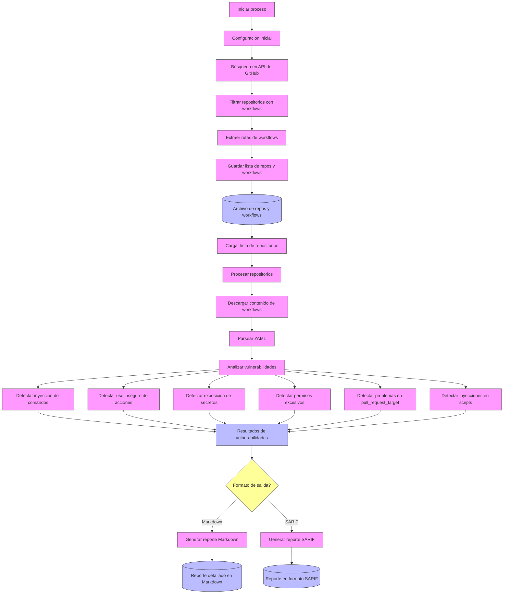

# PoC Analizador de vulnerabilidades en workflows públicos

Se analizan workflows de GitHub Actions en busca de vulnerabilidades de seguridad comunes, proporcionando informes detallados para ayudar a mejorar la seguridad de las configuraciones de CI/CD. 

## 📋 Índice

- [Descripción General](#descripción-general)
- [Características](#características)
- [Arquitectura y Flujo de Trabajo](#arquitectura-y-flujo-de-trabajo)
- [Base de Datos de Vulnerabilidades](#base-de-datos-de-vulnerabilidades)
- [Instalación](#instalación)
- [Uso](#uso)
- [Tipos de Vulnerabilidades Detectadas](#tipos-de-vulnerabilidades-detectadas)
- [Lógica de Detección](#lógica-de-detección)
- [Estructura del Proyecto](#estructura-del-proyecto)

## Descripción General

Este proyecto **poc-tesis** es una herramienta diseñada para analizar estáticamente archivos de flujo de trabajo de GitHub Actions y detectar patrones de código que podrían representar vulnerabilidades de seguridad. La herramienta opera en dos fases:

1. **Recolección**: Búsqueda y recopilación de archivos de workflows de múltiples repositorios públicos de GitHub
2. **Análisis**: Examen de cada workflow para identificar patrones de vulnerabilidades comunes basados en reglas predefinidas

Este proyecto surge de la necesidad de evaluar la seguridad de las configuraciones de CI/CD en GitHub Actions, ya que representan un vector de ataque cada vez más explotado.

## Características

- **Escalable**: Puede analizar desde uno hasta miles de repositorios (exp. 6k)
- **Modular**: Arquitectura basada en componentes que facilita añadir nuevos detectores de vulnerabilidades (el objetivo es utilizar la BD de GHAS a futuro)
- **Múltiples Formatos de Salida**: Genera reportes en Markdown o SARIF para integración con herramientas de análisis estático (GHAS soporta SARIF en other tools)
- **Análisis Contextual**: Cada vulnerabilidad incluye información de severidad, código vulnerable, impacto y recomendaciones de mitigación
- **Sin Dependencias Externas**: No requiere bases de datos ni servicios adicionales más allá de la API de GitHub
- **Enfoque en Seguridad Real**: Basado en patrones de vulnerabilidades documentados y exploits conocidos (Se pueden agregar más patrones de reconocimiento adhoc)

## Arquitectura y Flujo de Trabajo

La herramienta sigue un flujo de trabajo de dos etapas definidas:

### 1. Fase de Recolección (Collector)

- Consume la API de búsqueda de GitHub para encontrar repositorios públicos con archivos en `.github/workflows/`
- Utiliza paginación y manejo de límites de tasa para procesar grandes cantidades de resultados (100 en indexación)
- Para cada repositorio, lista y almacena las rutas de archivos workflow (YAML)
- Guarda los resultados en un archivo intermedio con el formato `owner/repo: ruta1,ruta2,...`

### 2. Fase de Análisis (Analyzer)

- Lee el archivo generado en la fase anterior
- Para cada repositorio, descarga el contenido de sus workflows
- Parsea el YAML y aplica múltiples detectores de vulnerabilidades
- Cada detector implementa reglas específicas para identificar patrones vulnerables
- Genera un reporte detallado con todas las vulnerabilidades encontradas

El diseño modular permite ejecutar estas fases de forma independiente, facilitando el procesamiento por lotes y la paralelización.

## Base de Datos de Vulnerabilidades

A diferencia de otras herramientas que dependen de bases de datos externas o APIs de vulnerabilidades, este analizador utiliza un enfoque basado en patrones codificados directamente en los detectores de vulnerabilidades. Cada detector implementa reglas derivadas de:

- Documentación oficial de seguridad de GitHub Actions
- Investigaciones publicadas sobre ataques a cadenas de suministro de CI/CD
- Incidentes reales documentados en GitHub Security Lab y otros recursos
- Análisis de CVEs y vulnerabilidades conocidas en flujos de CI/CD

Este enfoque basado en patrones permite:
- Funcionar sin conexión a internet (excepto para acceder a GitHub)
- Evitar falsos positivos comunes en bases de datos generales de vulnerabilidades
- Actualizar fácilmente los patrones cuando se descubren nuevas técnicas de ataque

## 🔧 Instalación

### Requisitos previos

- Go 1.17 o superior
- Token de GitHub con permisos para acceder a los repositorios a analizar

### Pasos de instalación

1. Clonar el repositorio:
```bash
git clone https://github.com/cmalvaceda/tesis-poc.git
cd tesis-poc
```

2. Ejecutar el script de configuración para crear la estructura de directorios necesaria:
```bash
chmod +x setup.sh
./setup.sh
```

3. Instalar dependencias:
```bash
go mod download
```

4. Configurar el token de GitHub:
```bash
# Crear archivo .env en la raíz del proyecto
echo "GITHUB_PAT=tu_token_personal_de_github" > .env
```

5. Verificar la estructura del proyecto:
```bash
chmod +x check_structure.sh
./check_structure.sh
```

## 🚀 Uso

### Usando el script de ejecución

Se incluye un script `run.sh` que facilita la ejecución de las diferentes fases:

```bash
# Hacer el script ejecutable
chmod +x run.sh

# Ver ayuda
./run.sh help

# Recolectar workflows (fase 1)
./run.sh collect -m 100 -o repositorios_con_workflows.txt

# Analizar workflows (fase 2)
./run.sh analyze -i repositorios_con_workflows.txt -o reporte_vulnerabilidades.md -f md

# Ejecutar ambas fases en secuencia
./run.sh all -m 100 -o reporte_final.md
```

### Ejecución manual de cada componente

También puedes ejecutar directamente los binarios Go:

#### Paso 1: Recolectar workflows de GitHub

```bash
go run cmd/collector/main.go -m 100 -o repositorios_con_workflows.txt
```

Opciones:
- `-m`: Número máximo de repositorios a procesar
- `-o`: Archivo de salida
- `-q`: Consulta personalizada para buscar repositorios (predeterminado: `path:.github/workflows`)

#### Paso 2: Analizar workflows en busca de vulnerabilidades

```bash
go run cmd/analyzer/main.go -i repositorios_con_workflows.txt -o reporte_vulnerabilidades.md -m 50 -f md
```

Opciones:
- `-i`: Archivo de entrada con lista de repositorios y workflows
- `-o`: Archivo de salida para el reporte
- `-m`: Número máximo de repositorios a analizar
- `-f`: Formato del reporte (`md` para Markdown, `sarif` para SARIF JSON)


## 🛡️ Tipos de Vulnerabilidades Detectadas

### 1. Command Injection (Inyección de Comandos)
Detecta cuando inputs de workflows se utilizan sin sanitizar en comandos shell, permitiendo potencialmente ejecutar comandos arbitrarios en el runner.

### 2. Unsafe Action Reference (Referencia Insegura a Acciones)
Identifica workflows que:
- Referencian acciones sin especificar una versión
- Utilizan ramas (main, master) en vez de referencias inmutables (SHA)
- No utilizan SHA completos para acciones de terceros

### 3. Secret Exposure (Exposición de Secretos)
Detecta patrones donde secretos podrían ser:
- Expuestos en logs mediante comandos de salida
- Almacenados en variables de entorno sin máscara adecuada
- Accesibles desde contextos inseguros

### 4. Excessive Permissions (Permisos Excesivos)
Identifica:
- Tokens con permisos de escritura o administrador innecesarios
- Ausencia de declaraciones explícitas de permisos
- Tokens con acceso a recursos sensibles sin necesidad

### 5. Unsafe pull_request_target (Uso Inseguro de pull_request_target)
Detecta workflows potencialmente vulnerables que:
- Utilizan el evento `pull_request_target` y hacen checkout del código del PR
- No utilizan referencias seguras (al repositorio base)
- Ejecutan código del PR con acceso a secretos

### 6. Script Injection (Inyección en Scripts)
Identifica scripts multilinea que podrían permitir inyección de código a través de:
- Variables de entorno no escapadas
- Inputs del workflow no sanitizados
- Contextos de GitHub utilizados de forma insegura

### 7. Undefined Permissions (Permisos No Definidos)
Alerta sobre workflows que no definen explícitamente permisos, utilizando los predeterminados que podrían ser excesivos.

### 8. Undefined Token Permissions (Permisos de Token No Definidos)
Detecta usos del token `GITHUB_TOKEN` sin especificar permisos limitados para operaciones específicas.

## Lógica de Detección

La detección de vulnerabilidades se implementa mediante una combinación de técnicas:

### Análisis Sintáctico
- Parsing completo de YAML para extraer la estructura del workflow
- Análisis de la topología del workflow, sus secciones y componentes

### Patrones Regulares
- Expresiones regulares cuidadosamente diseñadas para identificar patrones vulnerables
- Búsqueda contextual que considera el entorno de las coincidencias

### Análisis Semántico
- Evaluación de la relación entre diferentes partes del workflow
- Comprensión del impacto de ciertos eventos y permisos en combinación

### Reducción de Falsos Positivos
- Verificaciones secundarias para confirmar que un patrón representa una vulnerabilidad real
- Exclusión de casos conocidos como seguros (patrones de sanitización, etc.)

Cada detector implementa una lógica específica para el tipo de vulnerabilidad que busca, con umbrales de severidad basados en:
- Facilidad de explotación
- Impacto potencial
- Existencia de explotación activa en la naturaleza

## Estructura del Proyecto

El proyecto sigue una estructura modular organizada por dominio de funcionalidad:

