# Automatización de Análisis de Seguridad para Workflows de GitHub Actions

Herramienta de automatización que configura GitHub Advanced Security (GHAS) en repositorios públicos para detectar vulnerabilidades en workflows, dependencias y código fuente, proporcionando análisis detallados para mejorar la seguridad de CI/CD.

## 📋 Índice

- [Descripción General](#descripción-general)
- [Características Principales](#características-principales)
- [Arquitectura y Flujo de Trabajo](#arquitectura-y-flujo-de-trabajo)
- [Automatización GHAS](#automatización-ghas)
- [Instalación](#instalación)
- [Uso](#uso)
- [Análisis de Seguridad](#análisis-de-seguridad)
- [Detección Inteligente de Lenguajes](#detección-inteligente-de-lenguajes)
- [Estructura del Proyecto](#estructura-del-proyecto)
- [Solución de Problemas](#solución-de-problemas)

## Descripción General

Este proyecto automatiza la aplicación de GitHub Advanced Security (GHAS) en repositorios públicos para detectar vulnerabilidades en workflows de GitHub Actions, código fuente y dependencias. La herramienta opera en dos fases principales:

1. **Descubrimiento**: Localiza repositorios públicos con workflows de GitHub Actions utilizando la API de GitHub
2. **Automatización GHAS**: Aplica configuraciones de seguridad avanzada mediante:
   - Creación de forks de repositorios
   - Detección inteligente de lenguajes de programación utilizados
   - Configuración de herramientas de análisis específicas para cada lenguaje
   - Activación automática de escaneos de seguridad

Este proyecto surge de la necesidad de evaluar y mejorar de forma masiva la seguridad de las configuraciones de CI/CD en GitHub Actions, ya que representan un vector de ataque cada vez más explotado.

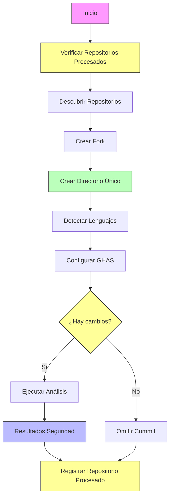

## Características Principales

- **Automatización Completa**: Configura y aplica herramientas de análisis de seguridad sin intervención manual
- **Detección Inteligente de Lenguajes**: Identifica con precisión los lenguajes de programación utilizados en cada repositorio
- **Soporte Multi-lenguaje**: Configura correctamente CodeQL para repositorios que utilizan múltiples lenguajes de programación
- **Gestión Avanzada de Forks**: Maneja la creación, actualización y limpieza de forks de repositorios
- **Procesamiento Incremental**: Mantiene un registro de repositorios procesados para evitar duplicación de trabajo
- **Manejo Inteligente de Errores**: Evita errores comunes como colisiones de directorios y commits sin cambios
- **Adaptabilidad**: Personaliza análisis según los lenguajes y características específicas de cada repositorio
- **Escalabilidad**: Procesa desde uno hasta miles de repositorios con manejo adecuado de límites de API
- **Configuración de Seguridad Integral**: Implementa múltiples capas de protección:
  - **CodeQL**: Análisis estático de código adaptado al lenguaje
  - **Dependabot**: Escaneo de vulnerabilidades en dependencias
  - **GitLeaks**: Detección de secretos expuestos
  - **Trivy**: Análisis de vulnerabilidades en contenedores

## Arquitectura y Flujo de Trabajo

La herramienta implementa un flujo completo en dos etapas principales que se pueden ejecutar juntas o de forma independiente:

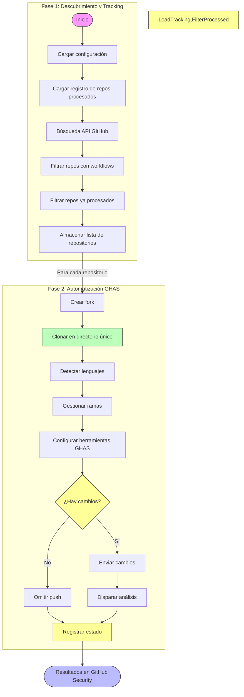

### 1. Fase de Descubrimiento

- **Búsqueda inteligente**: Utiliza la API de GitHub para localizar repositorios con workflows de GitHub Actions
- **Filtrado preciso**: Identifica repositorios adecuados para análisis GHAS
- **Priorización**: Selecciona repositorios relevantes según criterios configurables
- **Escalabilidad**: Maneja grandes volúmenes de datos con paginación y control de límites de API
- **Persistencia**: Almacena resultados para procesamiento posterior

### 2. Fase de Automatización GHAS

Esta fase configura y aplica GitHub Advanced Security en cada repositorio identificado:

- **Creación de forks**: Genera copias controladas para análisis sin afectar repositorios originales
- **Detección de lenguajes**: Analiza estructura de archivos para identificar lenguajes utilizados
- **Configuración adaptativa**: Personaliza herramientas GHAS según las características del repositorio
- **Gestión avanzada**: Maneja ramas, commits y sincronización con GitHub
- **Activación automática**: Configura el análisis para ejecutarse inmediatamente

### Tecnologías GHAS Implementadas

La herramienta configura automáticamente cuatro tecnologías complementarias de análisis:

1. **CodeQL**: Análisis estático que detecta vulnerabilidades en el código fuente
   - Adaptado automáticamente a los lenguajes detectados
   - Configurado con consultas específicas según contexto

2. **Dependabot**: Escaneo de dependencias vulnerables
   - Configurado según el ecosistema de paquetes del repositorio
   - Monitoreo continuo de actualizaciones de seguridad

3. **GitLeaks**: Detección de secretos expuestos
   - Identifica tokens, claves y credenciales comprometidas
   - Previene fugas de información sensible

4. **Trivy**: Análisis de vulnerabilidades en contenedores
   - Escanea imágenes Docker
   - Identifica vulnerabilidades en el sistema operativo base y paquetes

## 🔧 Instalación

### Requisitos previos

- Go 1.17 o superior
- Token de GitHub con permisos para acceder a los repositorios a analizar

### Pasos de instalación

1. Clonar el repositorio:
```bash
git clone https://github.com/cmalvaceda/tesis-poc.git
cd tesis-poc
```

2. Ejecutar el script de configuración para crear la estructura de directorios necesaria:
```bash
chmod +x setup.sh
./setup.sh
```

3. Instalar dependencias:
```bash
go mod download
```

4. Configurar el token de GitHub:
```bash
# Crear archivo .env en la raíz del proyecto
echo "GITHUB_PAT=tu_token_personal_de_github" > .env
```

5. Verificar la estructura del proyecto:
```bash
chmod +x check_structure.sh
./check_structure.sh
```

## 🚀 Uso

### Flujo de trabajo principal (ghas-full-flow.sh)

El script `ghas-full-flow.sh` proporciona la interfaz principal para utilizar la herramienta de automatización GHAS:

```mermaid
flowchart LR
    Start([ghas-full-flow.sh]) --> OptionType{Tipo de operación}
    OptionType --> |--repo| SingleRepo[Procesar un repositorio específico]
    OptionType --> |--collect-only| CollectOnly[Solo recolectar repositorios]
    OptionType --> |--userinfo| UserInfo[Mostrar información de usuario]
    OptionType --> |--processed| TrackFile[Usar archivo de tracking]
    OptionType --> |--skip-processed| SkipProc[Omitir repos procesados]
    OptionType --> |Default| ProcessAll[Flujo completo con múltiples repos]
    
    SingleRepo --> ProcessCheck{¿Ya procesado?}
    ProcessCheck -->|Sí, --skip-processed| Skip[Omitir repositorio]
    ProcessCheck -->|No| Fork[Crear fork]
    
    CollectOnly --> SaveList[Guardar lista de repositorios]
    TrackFile --> ProcessAll
    SkipProc --> ProcessAll
    ProcessAll --> Search[Buscar repositorios]
    Search --> ProcessCheck
    
    Fork --> UniqueDirs[Crear directorios únicos]
    UniqueDirs --> Configure[Configurar GHAS]
    Configure --> ChangeCheck{¿Hay cambios?}
    ChangeCheck -->|Sí| ApplyChanges[Aplicar y enviar cambios]
    ChangeCheck -->|No| NoChanges[Registrar sin cambios]
    
    ApplyChanges --> UpdateTracking[Actualizar registro]
    NoChanges --> UpdateTracking
    Skip --> UpdateTracking
    
    UpdateTracking --> Results[Resultados en GitHub Security]
    
    class Start,Results round
    style Start fill:#f9f,stroke:#333
    style Results fill:#bbf,stroke:#333
    style ProcessCheck,TrackFile,SkipProc fill:#ff9,stroke:#333
    style UniqueDirs fill:#bfb,stroke:#333
    style ChangeCheck fill:#ff9,stroke:#333
    style UpdateTracking fill:#ff9,stroke:#333
```

#### Ejemplos de uso

```bash
# Procesar un repositorio específico
./ghas-full-flow.sh -r usuario/repositorio

# Verificar información del usuario autenticado y sus forks
./ghas-full-flow.sh --userinfo

# Buscar hasta 5 repositorios sin aplicar GHAS (solo recolección)
./ghas-full-flow.sh --collect-only -m 5 -o repositorios_candidatos.txt

# Forzar actualización de configuraciones GHAS existentes
./ghas-full-flow.sh -r usuario/repositorio --force

# Flujo completo con limpieza de forks después del análisis
./ghas-full-flow.sh -m 3 --cleanup

# Procesar repositorios incluso si ya han sido procesados anteriormente
./ghas-full-flow.sh -m 5 --skip-processed=false

# Usar un archivo diferente para el registro de repositorios procesados
./ghas-full-flow.sh -m 10 --processed mi_registro_personalizado.json
```

#### Opciones disponibles

| Opción            | Descripción                                               | Valor predeterminado |
|-------------------|-----------------------------------------------------------|----------------------|
| `-r, --repo`      | Procesar un repositorio específico (formato: usuario/repo)| -                    |
| `-m, --max`       | Número máximo de repositorios a procesar                  | 10                   |
| `-o, --output`    | Archivo de salida para guardar resultados                 | repos_workflows_ghas.txt |
| `-q, --query`     | Consulta personalizada para buscar repositorios           | path:.github/workflows |
| `--processed`     | Archivo para el registro de repositorios procesados       | processed_repos.json |
| `--skip-processed`| Omitir repositorios ya procesados                         | true                 |
| `--no-gitleaks`   | Desactivar análisis de secretos con GitLeaks             | false                |
| `--no-container`  | Desactivar análisis de contenedores Docker                | false                |
| `--cleanup`       | Eliminar forks después del análisis                       | false                |
| `--collect-only`  | Sólo recolectar repositorios sin aplicar GHAS             | false                |
| `--userinfo`      | Mostrar información del usuario autenticado y sus forks   | false                |
| `--force`         | Forzar actualización en repositorios con configuración    | false                |

### Ejemplos de Flujos de Trabajo

#### 1. Análisis de un solo repositorio

Para analizar un repositorio específico y aplicar GHAS:

```bash
./ghas-full-flow.sh -r microsoft/setup-msbuild
```

Este comando:
1. Crea un fork del repositorio en su cuenta
2. Detecta los lenguajes utilizados
3. Configura las herramientas de seguridad
4. Activa los análisis automáticamente

#### 2. Búsqueda y selección de repositorios

Para buscar repositorios y luego decidir cuáles analizar:

```bash
# Paso 1: Recolectar solo candidatos
./ghas-full-flow.sh --collect-only -q "path:.github/workflows language:javascript" -m 5 -o js_repos.txt

# Paso 2: Examinar candidatos (manualmente)
cat js_repos.txt

# Paso 3: Aplicar GHAS a un repositorio específico de la lista
./ghas-full-flow.sh -r usuario/repositorio 
```

#### 3. Ver información de su cuenta y forks

Para gestionar los forks creados:

```bash
./ghas-full-flow.sh --userinfo
```

Este comando muestra:
- Detalles de la cuenta autenticada
- Lista de forks existentes
- Fecha de creación de cada fork

### Acceso a los resultados

Una vez completada la automatización, los resultados pueden visualizarse:

1. Navegue a `https://github.com/su-usuario/repositorio-fork`
2. Vaya a la pestaña "Security"
3. Explore las diferentes secciones:
   - "Code scanning alerts" (resultados de CodeQL)
   - "Dependabot alerts" (vulnerabilidades en dependencias)
   - "Secret scanning alerts" (secretos detectados)
   - "Container scanning" (vulnerabilidades en contenedores)


## Análisis de Seguridad

La herramienta aprovecha GitHub Advanced Security para detectar diversos tipos de vulnerabilidades de seguridad en los repositorios analizados. Este enfoque permite identificar problemas en múltiples dimensiones:

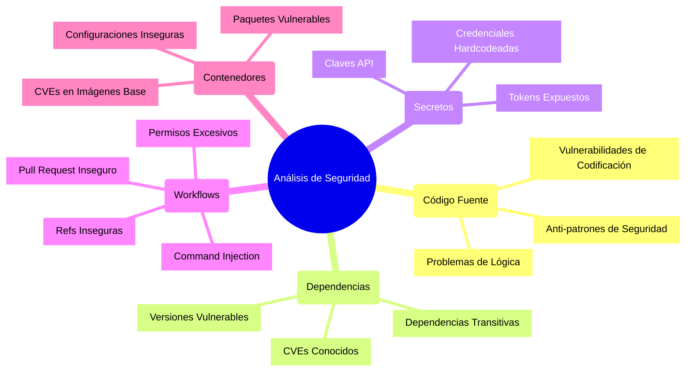

### Vulnerabilidades en Workflows

Las herramientas configuradas por este sistema permiten detectar problemas de seguridad específicos en workflows de GitHub Actions:

#### 1. Command Injection (Inyección de Comandos)
Detecta cuando inputs de workflows se utilizan sin sanitizar en comandos shell, permitiendo potencialmente ejecutar comandos arbitrarios en el runner.

```yaml
# Ejemplo vulnerable
- name: Run script
  run: echo ${{ github.event.comment.body }} > output.txt
```

#### 2. Unsafe Action Reference (Referencia Insegura a Acciones)
Identifica workflows que:
- Referencian acciones sin especificar una versión
- Utilizan ramas (main, master) en vez de referencias inmutables (SHA)
- No utilizan SHA completos para acciones de terceros

```yaml
# Ejemplo vulnerable
- uses: actions/checkout@main  # Debería usar una versión específica o SHA
```

#### 3. Secret Exposure (Exposición de Secretos)
Detecta patrones donde secretos podrían ser:
- Expuestos en logs mediante comandos de salida
- Almacenados en variables de entorno sin máscara adecuada
- Accesibles desde contextos inseguros

```yaml
# Ejemplo vulnerable
- run: echo "Token is ${{ secrets.API_TOKEN }}"
```

#### 4. Excessive Permissions (Permisos Excesivos)
Identifica:
- Tokens con permisos de escritura o administrador innecesarios
- Ausencia de declaraciones explícitas de permisos
- Tokens con acceso a recursos sensibles sin necesidad

```yaml
# Ejemplo vulnerable - sin permisos explícitos
name: Build
on: push
jobs:
  build:
    runs-on: ubuntu-latest
    steps:
      - uses: actions/checkout@v3
```

#### 5. Unsafe pull_request_target (Uso Inseguro de pull_request_target)
Detecta workflows potencialmente vulnerables que:
- Utilizan el evento `pull_request_target` y hacen checkout del código del PR
- No utilizan referencias seguras (al repositorio base)
- Ejecutan código del PR con acceso a secretos

```yaml
# Ejemplo vulnerable
on:
  pull_request_target:
jobs:
  build:
    runs-on: ubuntu-latest
    steps:
      - uses: actions/checkout@v3
        with:
          ref: ${{ github.event.pull_request.head.ref }}
      - run: npm install && npm test
```

### Detección mediante GitHub Advanced Security

La configuración implementada en cada repositorio permite que GitHub Advanced Security realice análisis en profundidad:

1. **CodeQL Analysis**:
   - Detecta vulnerabilidades mediante análisis estático de código
   - Identifica patrones como inyección de SQL, XSS, uso inseguro de funciones
   - Adapta las consultas al lenguaje de programación utilizado

2. **Dependabot Alerts**:
   - Monitoreo continuo de dependencias
   - Alertas sobre vulnerabilidades conocidas en librerías utilizadas
   - Creación automática de pull requests para actualizar dependencias vulnerables

3. **Secret Scanning**:
   - Detección de secretos expuestos en el código
   - Reconocimiento de patrones de tokens de servicios como AWS, Azure, GitHub
   - Alertas inmediatas sobre credenciales comprometidas

4. **Container Scanning**:
   - Análisis de imágenes Docker
   - Detección de CVEs en sistemas operativos base y paquetes instalados
   - Recomendaciones para mitigar vulnerabilidades identificadas

### Visualización de Resultados

Los resultados de los análisis de seguridad estarán disponibles en la pestaña "Security" del repositorio fork:

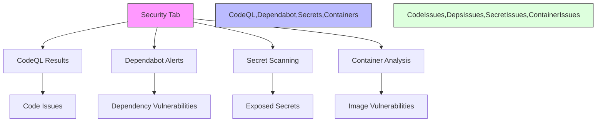

## Estructura del Proyecto

El proyecto sigue una estructura modular organizada por dominio de funcionalidad:

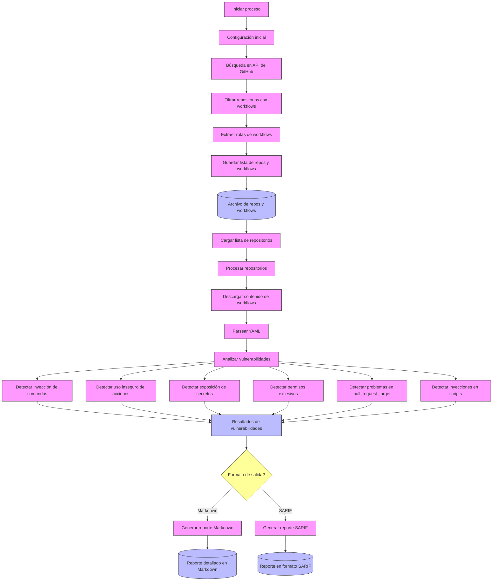

## Automatización de GitHub Advanced Security (GHAS)

Este proyecto incluye herramientas para automatizar la configuración y análisis de seguridad utilizando GitHub Advanced Security (GHAS) en repositorios públicos.

### Características de la automatización GHAS

- **Detección automática**: Busca repositorios públicos con workflows de GitHub Actions
- **Detección inteligente de lenguajes**: Analiza el código fuente para identificar correctamente los lenguajes utilizados
- **Configuración completa**: Configura automáticamente:
  - CodeQL para análisis estático de código
  - Dependabot para escaneo de dependencias
  - GitLeaks para detección de secretos
  - Trivy para análisis de vulnerabilidades en contenedores
- **Gestión de forks**: Crea forks de repositorios para aplicar y ejecutar herramientas GHAS
- **Manejo inteligente de ramas**: Detecta branches existentes y permite actualizaciones forzadas
- **Gestión avanzada de autenticación**: Configura correctamente las credenciales para operaciones Git
- **Sistema de control de procesamiento**: Registra y gestiona repositorios ya procesados para evitar trabajo duplicado
- **Manejo robusto de errores comunes**: Evita problemas como colisiones de directorios y commits sin cambios

### Flujo de Trabajo Completo de GHAS Automation

El proceso de automatización GHAS consiste en dos fases principales:

#### Fase 1: Recolección de Repositorios

1. **Búsqueda de Repositorios**: Utiliza la API de GitHub para buscar repositorios con workflows de GitHub Actions
2. **Filtrado de Repositorios**: Verifica que cada repositorio encontrado cumpla con los criterios necesarios
3. **Almacenamiento**: Guarda la lista de repositorios candidatos para la automatización GHAS

#### Fase 2: Aplicación de GHAS

Para cada repositorio identificado:

1. **Creación de Fork**: Crea un fork del repositorio en la cuenta del usuario autenticado
2. **Clonación**: Clona el repositorio fork en una ubicación temporal
3. **Detección de Lenguajes**: Analiza los archivos del proyecto para identificar los lenguajes utilizados:
   - Mapeo de extensiones de archivos a lenguajes soportados por CodeQL
   - Identificación de lenguajes predominantes basado en número de archivos
   - Detección de múltiples lenguajes relevantes
4. **Gestión de Ramas**: 
   - Verifica si existe la rama `ghas-analysis`
   - Actualiza la configuración existente o crea una nueva rama según se requiera
5. **Configuración de Herramientas**:
   - Configura workflow de CodeQL adaptado a los lenguajes detectados
   - Configura Dependabot según el ecosistema de paquetes identificado
   - Configura GitLeaks para detección de secretos
   - Configura Trivy para análisis de vulnerabilidades en contenedores
6. **Aplicación de Cambios**:
   - Realiza commit de las configuraciones
   - Envía los cambios al repositorio fork
7. **Activación Automática**: Las configuraciones aplicadas activan automáticamente el análisis GHAS

### Uso de la herramienta de automatización GHAS

Puede ejecutar el flujo completo usando el script `ghas-full-flow.sh`:

```bash
# Buscar repositorios y aplicar GHAS a uno específico
./ghas-full-flow.sh -r propietario/repositorio

# Buscar hasta 5 repositorios y sólo recolectar información (sin aplicar GHAS)
./ghas-full-flow.sh --collect-only -m 5 -o repositorios_candidatos.txt

# Aplicar GHAS a los repositorios previamente recolectados
./ghas-full-flow.sh --no-collect -i repositorios_candidatos.txt

# Forzar actualización de repositorios que ya tienen configuración GHAS
./ghas-full-flow.sh -r propietario/repositorio --force

# Usar un archivo específico para registrar repositorios procesados
./ghas-full-flow.sh -m 20 --processed mi_registro_repos.json

# Procesar repositorios incluso si ya fueron procesados anteriormente
./ghas-full-flow.sh --skip-processed=false

# Procesar repositorios nuevos y omitir los ya procesados con éxito
./ghas-full-flow.sh --processed-repos registro_previo.json --skip-processed

# Verificar qué repositorios se han procesado y cuáles no
cat processed_repos.json

# Ver información del usuario autenticado y sus forks
./ghas-full-flow.sh --userinfo
```

Los resultados del análisis GHAS estarán disponibles en la pestaña "Seguridad" de cada repositorio fork en GitHub.

## Sistema de Control de Repositorios Procesados

El sistema incorpora un mecanismo inteligente para rastrear y gestionar repositorios ya procesados, lo que mejora la eficiencia y previene errores en ejecuciones repetidas:

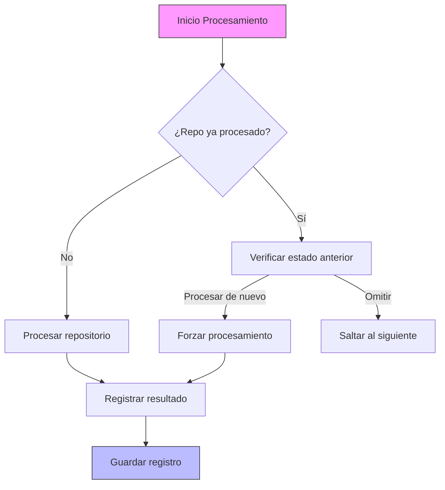

### Arquitectura del Sistema de Tracking

El sistema de tracking de repositorios se implementa mediante un flujo robusto que evita procesamiento redundante:

```mermaid
flowchart TB
    subgraph "Sistema de Tracking de Repositorios"
    
    Init[Inicio del Proceso] --> LoadJSON[Cargar JSON de repos procesados]
    LoadJSON --> CheckFile{¿Archivo existe?}
    CheckFile -->|No| CreateEmpty[Crear registro vacío]
    CheckFile -->|Sí| ParseJSON[Parsear JSON existente]
    
    CreateEmpty --> ProcessLogic
    ParseJSON --> ProcessLogic
    
    subgraph "ProcessLogic"
    RepoCheck{¿Repositorio en registro?}
    RepoCheck -->|Sí| SkipCheck{¿Omitir procesados?}
    SkipCheck -->|Sí| SkipRepo[Omitir repositorio]
    SkipCheck -->|No| ProcessAnyway[Procesar de todos modos]
    RepoCheck -->|No| ProcessRepo[Procesar repo nuevo]
    end
    
    ProcessRepo --> SaveResult[Guardar resultado]
    ProcessAnyway --> SaveResult
    SkipRepo --> UpdateStats[Actualizar estadísticas]
    SaveResult --> UpdateStats
    
    UpdateStats --> SaveJSON[Guardar JSON actualizado]
    SaveJSON --> End[Fin del proceso]
    
    end
    
    class Init,End round
    style Init fill:#f9f,stroke:#333
    style End fill:#bbf,stroke:#333
    style LoadJSON,ParseJSON,SaveJSON fill:#bfb,stroke:#333
    style RepoCheck,SkipCheck fill:#ff9,stroke:#333
    style ProcessRepo,ProcessAnyway fill:#f93,stroke:#333
    style SkipRepo fill:#9cf,stroke:#333
```

### Características del Sistema de Control

- **Registro JSON Persistente**: Almacena información detallada de cada repositorio procesado en `processed_repos.json`
- **Información de Estado**: Registra para cada repositorio:
  - Nombre completo del repositorio
  - Timestamp de procesamiento
  - Estado de éxito/error
  - Mensaje descriptivo
- **Procesamiento Inteligente**: Evita procesar repetidamente los mismos repositorios, ahorrando tiempo y recursos
- **Control de Flujo Configurable**: Permite omitir o forzar el procesamiento de repositorios previamente procesados
- **Informe Detallado**: Proporciona estadísticas sobre repositorios procesados y omitidos

Ejemplo de la estructura JSON del sistema de tracking:

```json
{
  "repositories": {
    "usuario/repo1": {
      "full_name": "usuario/repo1",
      "processed_at": "2025-05-18T15:42:13.123456789Z",
      "success": true,
      "message": "Procesado correctamente"
    },
    "usuario/repo2": {
      "full_name": "usuario/repo2",
      "processed_at": "2025-05-18T15:45:22.987654321Z",
      "success": false,
      "message": "Error al configurar CodeQL: lenguaje no soportado"
    }
  }
}

### Opciones de Configuración Relacionadas

| Opción | Descripción |
|--------|-------------|
| `--processed <archivo>` | Especifica el archivo para almacenar el registro de repositorios procesados |
| `--skip-processed` | Omite repositorios ya procesados (habilitado por defecto) |
| `--skip-processed=false` | Procesa todos los repositorios incluso si ya fueron procesados anteriormente |

### Beneficios

- **Eficiencia mejorada**: Procesa automáticamente solo repositorios nuevos o que requieren actualización
- **Continuidad en errores**: Permite retomar el procesamiento desde el último punto en caso de interrupción
- **Auditoría de procesos**: Facilita el seguimiento histórico de los repositorios analizados
- **Estadísticas de procesamiento**: Proporciona métricas sobre el alcance y efectividad del análisis

### Implementación Técnica

La gestión de repositorios procesados se implementa mediante estructuras de datos en Go y persistencia en JSON:

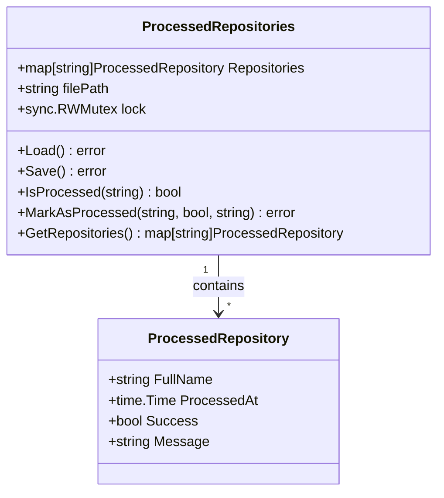

El sistema utiliza un mecanismo seguro para concurrencia con mutexes que garantiza la integridad de los datos incluso al procesar múltiples repositorios en paralelo.

## Optimizaciones Técnicas

### Escalabilidad y Procesamiento Masivo

El sistema de tracking de repositorios permite procesar grandes volúmenes de repositorios con mayor eficiencia:

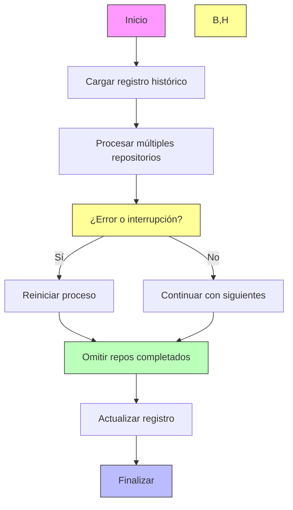

Esta implementación permite:
- **Procesamiento Incremental**: Continuar desde el punto de interrupción en caso de fallos
- **Procesamiento por Lotes**: Dividir grandes conjuntos de repositorios en sesiones manejables
- **Recuperación Inteligente**: Recuperarse de errores sin perder el trabajo ya realizado
- **Optimización de Recursos**: Evitar repetir análisis de repositorios ya procesados correctamente

### Resolución de Colisiones de Directorios y Manejo de Git

La herramienta incorpora mejoras críticas para la robustez en entornos de producción:

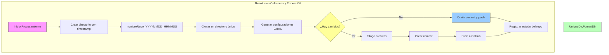

Esta implementación resuelve dos problemas críticos:
1. **Colisión de directorios**: Usando nombres únicos con timestamps para cada operación de clonado
2. **Errores de Git**: Verificando la existencia de cambios antes de intentar commits