# Automatización de Análisis de Seguridad para Workflows de GitHub Actions

Herramienta de automatización que configura GitHub Advanced Security (GHAS) en repositorios públicos para detectar vulnerabilidades en workflows, dependencias y código fuente, proporcionando análisis detallados para mejorar la seguridad de CI/CD.

## 📋 Índice

- [Descripción General](#descripción-general)
- [Características Principales](#características-principales)
- [Arquitectura y Flujo de Trabajo](#arquitectura-y-flujo-de-trabajo)
- [Automatización GHAS](#automatización-ghas)
- [Instalación](#instalación)
- [Uso](#uso)
- [Análisis de Seguridad](#análisis-de-seguridad)
- [Detección Inteligente de Lenguajes](#detección-inteligente-de-lenguajes)
- [Estructura del Proyecto](#estructura-del-proyecto)
- [Solución de Problemas](#solución-de-problemas)

## Descripción General

Este proyecto automatiza la aplicación de GitHub Advanced Security (GHAS) en repositorios públicos para detectar vulnerabilidades en workflows de GitHub Actions, código fuente y dependencias. La herramienta opera en dos fases principales:

1. **Descubrimiento**: Localiza repositorios públicos con workflows de GitHub Actions utilizando la API de GitHub
2. **Automatización GHAS**: Aplica configuraciones de seguridad avanzada mediante:
   - Creación de forks de repositorios
   - Detección inteligente de lenguajes de programación utilizados
   - Configuración de herramientas de análisis específicas para cada lenguaje
   - Activación automática de escaneos de seguridad

Este proyecto surge de la necesidad de evaluar y mejorar de forma masiva la seguridad de las configuraciones de CI/CD en GitHub Actions, ya que representan un vector de ataque cada vez más explotado.

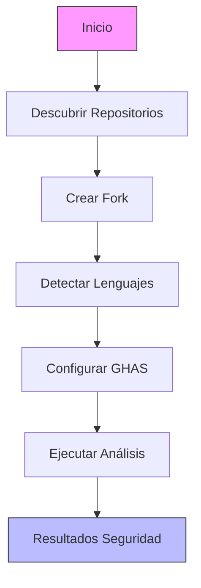
```mermaid
graph TD
    A[Inicio] --> B[Descubrir Repositorios]
    B --> C[Crear Fork]
    C --> D[Detectar Lenguajes]
    D --> E[Configurar GHAS]
    E --> F[Ejecutar Análisis]
    F --> G[Resultados Seguridad]
    
    style A fill:#f9f,stroke:#333
    style G fill:#bbf,stroke:#333
```

## Características Principales

- **Automatización Completa**: Configura y aplica herramientas de análisis de seguridad sin intervención manual
- **Detección Inteligente de Lenguajes**: Identifica con precisión los lenguajes de programación utilizados en cada repositorio
- **Soporte Multi-lenguaje**: Configura correctamente CodeQL para repositorios que utilizan múltiples lenguajes de programación
- **Gestión Avanzada de Forks**: Maneja la creación, actualización y limpieza de forks de repositorios
- **Adaptabilidad**: Personaliza análisis según los lenguajes y características específicas de cada repositorio
- **Escalabilidad**: Procesa desde uno hasta miles de repositorios con manejo adecuado de límites de API
- **Configuración de Seguridad Integral**: Implementa múltiples capas de protección:
  - **CodeQL**: Análisis estático de código adaptado al lenguaje
  - **Dependabot**: Escaneo de vulnerabilidades en dependencias
  - **GitLeaks**: Detección de secretos expuestos
  - **Trivy**: Análisis de vulnerabilidades en contenedores

## Arquitectura y Flujo de Trabajo

La herramienta implementa un flujo completo en dos etapas principales que se pueden ejecutar juntas o de forma independiente:

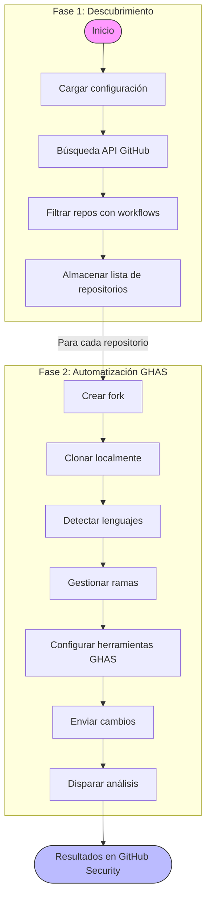
```mermaid
flowchart TB
    subgraph "Fase 1: Descubrimiento"
    Start([Inicio]) --> ConfigInit[Cargar configuración]
    ConfigInit --> APISearch[Búsqueda API GitHub]
    APISearch --> FilterWorkflows[Filtrar repos con workflows]
    FilterWorkflows --> StoreRepos[Almacenar lista de repositorios]
    end
    
    subgraph "Fase 2: Automatización GHAS" 
    StoreRepos --> |Para cada repositorio| Fork[Crear fork]
    Fork --> Clone[Clonar localmente]
    Clone --> LangDetect[Detectar lenguajes]
    LangDetect --> BranchMgmt[Gestionar ramas]
    BranchMgmt --> ConfigTools[Configurar herramientas GHAS]
    ConfigTools --> Push[Enviar cambios]
    Push --> TriggerAnalysis[Disparar análisis]
    end
    
    TriggerAnalysis --> Results([Resultados en GitHub Security])

    class Start,Results round
    style Start fill:#f9f,stroke:#333
    style Results fill:#bbf,stroke:#333
```

### 1. Fase de Descubrimiento

- **Búsqueda inteligente**: Utiliza la API de GitHub para localizar repositorios con workflows de GitHub Actions
- **Filtrado preciso**: Identifica repositorios adecuados para análisis GHAS
- **Priorización**: Selecciona repositorios relevantes según criterios configurables
- **Escalabilidad**: Maneja grandes volúmenes de datos con paginación y control de límites de API
- **Persistencia**: Almacena resultados para procesamiento posterior

### 2. Fase de Automatización GHAS

Esta fase configura y aplica GitHub Advanced Security en cada repositorio identificado:

- **Creación de forks**: Genera copias controladas para análisis sin afectar repositorios originales
- **Detección de lenguajes**: Analiza estructura de archivos para identificar lenguajes utilizados
- **Configuración adaptativa**: Personaliza herramientas GHAS según las características del repositorio
- **Gestión avanzada**: Maneja ramas, commits y sincronización con GitHub
- **Activación automática**: Configura el análisis para ejecutarse inmediatamente

### Tecnologías GHAS Implementadas

La herramienta configura automáticamente cuatro tecnologías complementarias de análisis:

1. **CodeQL**: Análisis estático que detecta vulnerabilidades en el código fuente
   - Adaptado automáticamente a los lenguajes detectados
   - Configurado con consultas específicas según contexto

2. **Dependabot**: Escaneo de dependencias vulnerables
   - Configurado según el ecosistema de paquetes del repositorio
   - Monitoreo continuo de actualizaciones de seguridad

3. **GitLeaks**: Detección de secretos expuestos
   - Identifica tokens, claves y credenciales comprometidas
   - Previene fugas de información sensible

4. **Trivy**: Análisis de vulnerabilidades en contenedores
   - Escanea imágenes Docker
   - Identifica vulnerabilidades en el sistema operativo base y paquetes

## 🔧 Instalación

### Requisitos previos

- Go 1.17 o superior
- Token de GitHub con permisos para acceder a los repositorios a analizar

### Pasos de instalación

1. Clonar el repositorio:
```bash
git clone https://github.com/cmalvaceda/tesis-poc.git
cd tesis-poc
```

2. Ejecutar el script de configuración para crear la estructura de directorios necesaria:
```bash
chmod +x setup.sh
./setup.sh
```

3. Instalar dependencias:
```bash
go mod download
```

4. Configurar el token de GitHub:
```bash
# Crear archivo .env en la raíz del proyecto
echo "GITHUB_PAT=tu_token_personal_de_github" > .env
```

5. Verificar la estructura del proyecto:
```bash
chmod +x check_structure.sh
./check_structure.sh
```

## 🚀 Uso

### Flujo de trabajo principal (ghas-full-flow.sh)

El script `ghas-full-flow.sh` proporciona la interfaz principal para utilizar la herramienta de automatización GHAS:

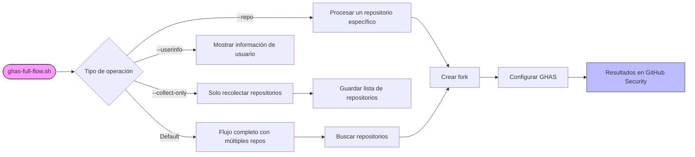
```mermaid
flowchart LR
    Start([ghas-full-flow.sh]) --> OptionType{Tipo de operación}
    OptionType --> |--repo| SingleRepo[Procesar un repositorio específico]
    OptionType --> |--collect-only| CollectOnly[Solo recolectar repositorios]
    OptionType --> |--userinfo| UserInfo[Mostrar información de usuario]
    OptionType --> |Default| ProcessAll[Flujo completo con múltiples repos]
    
    SingleRepo --> Fork[Crear fork]
    CollectOnly --> SaveList[Guardar lista de repositorios]
    ProcessAll --> Search[Buscar repositorios]
    Search --> Fork
    
    Fork --> Configure[Configurar GHAS]
    Configure --> Results[Resultados en GitHub Security]
    
    class Start,Results round
    style Start fill:#f9f,stroke:#333
    style Results fill:#bbf,stroke:#333
```

#### Ejemplos de uso

```bash
# Procesar un repositorio específico
./ghas-full-flow.sh -r usuario/repositorio

# Verificar información del usuario autenticado y sus forks
./ghas-full-flow.sh --userinfo

# Buscar hasta 5 repositorios sin aplicar GHAS (solo recolección)
./ghas-full-flow.sh --collect-only -m 5 -o repositorios_candidatos.txt

# Forzar actualización de configuraciones GHAS existentes
./ghas-full-flow.sh -r usuario/repositorio --force

# Flujo completo con limpieza de forks después del análisis
./ghas-full-flow.sh -m 3 --cleanup
```

#### Opciones disponibles

| Opción            | Descripción                                               | Valor predeterminado |
|-------------------|-----------------------------------------------------------|----------------------|
| `-r, --repo`      | Procesar un repositorio específico (formato: usuario/repo)| -                    |
| `-m, --max`       | Número máximo de repositorios a procesar                  | 10                   |
| `-o, --output`    | Archivo de salida para guardar resultados                 | repos_workflows_ghas.txt |
| `-q, --query`     | Consulta personalizada para buscar repositorios           | path:.github/workflows |
| `--no-gitleaks`   | Desactivar análisis de secretos con GitLeaks             | false                |
| `--no-container`  | Desactivar análisis de contenedores Docker                | false                |
| `--cleanup`       | Eliminar forks después del análisis                       | false                |
| `--collect-only`  | Sólo recolectar repositorios sin aplicar GHAS             | false                |
| `--userinfo`      | Mostrar información del usuario autenticado y sus forks   | false                |
| `--force`         | Forzar actualización en repositorios con configuración    | false                |

### Ejemplos de Flujos de Trabajo

#### 1. Análisis de un solo repositorio

Para analizar un repositorio específico y aplicar GHAS:

```bash
./ghas-full-flow.sh -r microsoft/setup-msbuild
```

Este comando:
1. Crea un fork del repositorio en su cuenta
2. Detecta los lenguajes utilizados
3. Configura las herramientas de seguridad
4. Activa los análisis automáticamente

#### 2. Búsqueda y selección de repositorios

Para buscar repositorios y luego decidir cuáles analizar:

```bash
# Paso 1: Recolectar solo candidatos
./ghas-full-flow.sh --collect-only -q "path:.github/workflows language:javascript" -m 5 -o js_repos.txt

# Paso 2: Examinar candidatos (manualmente)
cat js_repos.txt

# Paso 3: Aplicar GHAS a un repositorio específico de la lista
./ghas-full-flow.sh -r usuario/repositorio 
```

#### 3. Ver información de su cuenta y forks

Para gestionar los forks creados:

```bash
./ghas-full-flow.sh --userinfo
```

Este comando muestra:
- Detalles de la cuenta autenticada
- Lista de forks existentes
- Fecha de creación de cada fork

### Acceso a los resultados

Una vez completada la automatización, los resultados pueden visualizarse:

1. Navegue a `https://github.com/su-usuario/repositorio-fork`
2. Vaya a la pestaña "Security"
3. Explore las diferentes secciones:
   - "Code scanning alerts" (resultados de CodeQL)
   - "Dependabot alerts" (vulnerabilidades en dependencias)
   - "Secret scanning alerts" (secretos detectados)
   - "Container scanning" (vulnerabilidades en contenedores)


## Análisis de Seguridad

La herramienta aprovecha GitHub Advanced Security para detectar diversos tipos de vulnerabilidades de seguridad en los repositorios analizados. Este enfoque permite identificar problemas en múltiples dimensiones:

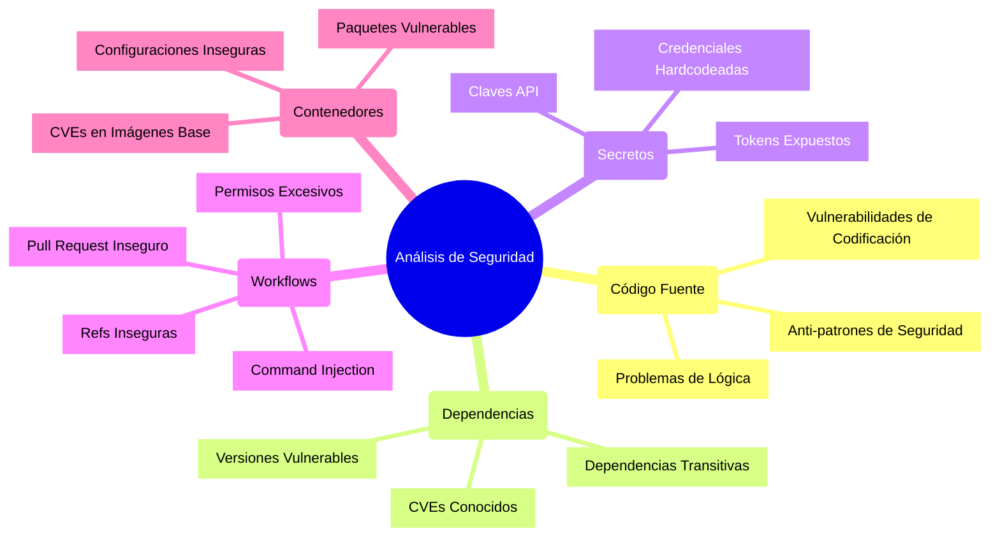
```mermaid
mindmap
  root((Análisis de Seguridad))
    (Código Fuente)
      [Vulnerabilidades de Codificación]
      [Problemas de Lógica]
      [Anti-patrones de Seguridad]
    (Dependencias)
      [CVEs Conocidos]
      [Versiones Vulnerables]
      [Dependencias Transitivas]
    (Secretos)
      [Tokens Expuestos]
      [Credenciales Hardcodeadas]
      [Claves API]
    (Workflows)
      [Command Injection]
      [Permisos Excesivos]
      [Refs Inseguras]
      [Pull Request Inseguro]
    (Contenedores)
      [CVEs en Imágenes Base]
      [Paquetes Vulnerables]
      [Configuraciones Inseguras]
```

### Vulnerabilidades en Workflows

Las herramientas configuradas por este sistema permiten detectar problemas de seguridad específicos en workflows de GitHub Actions:

#### 1. Command Injection (Inyección de Comandos)
Detecta cuando inputs de workflows se utilizan sin sanitizar en comandos shell, permitiendo potencialmente ejecutar comandos arbitrarios en el runner.

```yaml
# Ejemplo vulnerable
- name: Run script
  run: echo ${{ github.event.comment.body }} > output.txt
```

#### 2. Unsafe Action Reference (Referencia Insegura a Acciones)
Identifica workflows que:
- Referencian acciones sin especificar una versión
- Utilizan ramas (main, master) en vez de referencias inmutables (SHA)
- No utilizan SHA completos para acciones de terceros

```yaml
# Ejemplo vulnerable
- uses: actions/checkout@main  # Debería usar una versión específica o SHA
```

#### 3. Secret Exposure (Exposición de Secretos)
Detecta patrones donde secretos podrían ser:
- Expuestos en logs mediante comandos de salida
- Almacenados en variables de entorno sin máscara adecuada
- Accesibles desde contextos inseguros

```yaml
# Ejemplo vulnerable
- run: echo "Token is ${{ secrets.API_TOKEN }}"
```

#### 4. Excessive Permissions (Permisos Excesivos)
Identifica:
- Tokens con permisos de escritura o administrador innecesarios
- Ausencia de declaraciones explícitas de permisos
- Tokens con acceso a recursos sensibles sin necesidad

```yaml
# Ejemplo vulnerable - sin permisos explícitos
name: Build
on: push
jobs:
  build:
    runs-on: ubuntu-latest
    steps:
      - uses: actions/checkout@v3
```

#### 5. Unsafe pull_request_target (Uso Inseguro de pull_request_target)
Detecta workflows potencialmente vulnerables que:
- Utilizan el evento `pull_request_target` y hacen checkout del código del PR
- No utilizan referencias seguras (al repositorio base)
- Ejecutan código del PR con acceso a secretos

```yaml
# Ejemplo vulnerable
on:
  pull_request_target:
jobs:
  build:
    runs-on: ubuntu-latest
    steps:
      - uses: actions/checkout@v3
        with:
          ref: ${{ github.event.pull_request.head.ref }}
      - run: npm install && npm test
```

### Detección mediante GitHub Advanced Security

La configuración implementada en cada repositorio permite que GitHub Advanced Security realice análisis en profundidad:

1. **CodeQL Analysis**:
   - Detecta vulnerabilidades mediante análisis estático de código
   - Identifica patrones como inyección de SQL, XSS, uso inseguro de funciones
   - Adapta las consultas al lenguaje de programación utilizado

2. **Dependabot Alerts**:
   - Monitoreo continuo de dependencias
   - Alertas sobre vulnerabilidades conocidas en librerías utilizadas
   - Creación automática de pull requests para actualizar dependencias vulnerables

3. **Secret Scanning**:
   - Detección de secretos expuestos en el código
   - Reconocimiento de patrones de tokens de servicios como AWS, Azure, GitHub
   - Alertas inmediatas sobre credenciales comprometidas

4. **Container Scanning**:
   - Análisis de imágenes Docker
   - Detección de CVEs en sistemas operativos base y paquetes instalados
   - Recomendaciones para mitigar vulnerabilidades identificadas

### Visualización de Resultados

Los resultados de los análisis de seguridad estarán disponibles en la pestaña "Security" del repositorio fork:

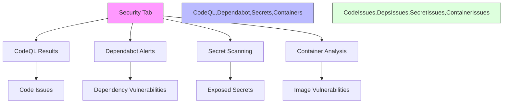
```mermaid
graph TB
    Security[Security Tab] --> CodeQL[CodeQL Results]
    Security --> Dependabot[Dependabot Alerts]
    Security --> Secrets[Secret Scanning]
    Security --> Containers[Container Analysis]
    
    CodeQL --> CodeIssues[Code Issues]
    Dependabot --> DepsIssues[Dependency Vulnerabilities]
    Secrets --> SecretIssues[Exposed Secrets]
    Containers --> ContainerIssues[Image Vulnerabilities]
    
    style Security fill:#f9f,stroke:#333
    style CodeQL,Dependabot,Secrets,Containers fill:#bbf,stroke:#333
    style CodeIssues,DepsIssues,SecretIssues,ContainerIssues fill:#dfd,stroke:#333
```

## Estructura del Proyecto

El proyecto sigue una estructura modular organizada por dominio de funcionalidad:

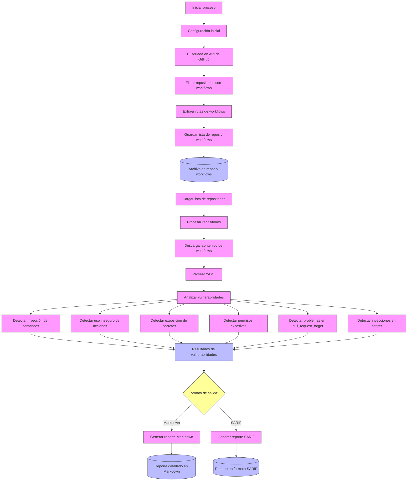
```mermaid
flowchart TD
    Start[Iniciar proceso] --> Config[Configuración inicial]
    Config --> Search[Búsqueda en API de GitHub]
    Search --> FilterRepos[Filtrar repositorios con workflows]
    FilterRepos --> ExtractWorkflows[Extraer rutas de workflows]
    ExtractWorkflows --> SaveList[Guardar lista de repos y workflows]
    SaveList --> RepositoriesList[(Archivo de repos y workflows)]
    
    %% Etapa 2: Análisis de vulnerabilidades
    RepositoriesList --> LoadRepos[Cargar lista de repositorios]
    LoadRepos --> ProcessRepos[Procesar repositorios]
    ProcessRepos --> DownloadContent[Descargar contenido de workflows]
    DownloadContent --> ParseYAML[Parsear YAML]
    ParseYAML --> Analyze[Analizar vulnerabilidades]
    
    %% Análisis por categoría
    Analyze --> CommandInjection[Detectar inyección de comandos]
    Analyze --> UnsafeActions[Detectar uso inseguro de acciones]
    Analyze --> SecretExposure[Detectar exposición de secretos]
    Analyze --> ExcessivePermissions[Detectar permisos excesivos]
    Analyze --> PRTargetVulns[Detectar problemas en pull_request_target]
    Analyze --> ScriptInjection[Detectar inyecciones en scripts]
    
    %% Resultados
    CommandInjection --> Results[Resultados de vulnerabilidades]
    UnsafeActions --> Results
    SecretExposure --> Results
    ExcessivePermissions --> Results
    PRTargetVulns --> Results
    ScriptInjection --> Results
    
    %% Generación de reportes
    Results --> FormatDecision{Formato de salida?}
    FormatDecision -- Markdown --> GenerateMD[Generar reporte Markdown]
    FormatDecision -- SARIF --> GenerateSARIF[Generar reporte SARIF]
    
    GenerateMD --> MDReport[(Reporte detallado en Markdown)]
    GenerateSARIF --> SARIFReport[(Reporte en formato SARIF)]
    
    %% Estilos
    classDef process fill:#f9f,stroke:#333,stroke-width:1px;
    classDef data fill:#bbf,stroke:#333,stroke-width:1px;
    classDef decision fill:#ff9,stroke:#333,stroke-width:1px;
    
    class Start,Config,Search,FilterRepos,ExtractWorkflows,SaveList,LoadRepos,ProcessRepos,DownloadContent,ParseYAML,Analyze,CommandInjection,UnsafeActions,SecretExposure,ExcessivePermissions,PRTargetVulns,ScriptInjection,GenerateMD,GenerateSARIF process;
    class RepositoriesList,Results,MDReport,SARIFReport data;
    class FormatDecision decision;
```

## Automatización de GitHub Advanced Security (GHAS)

Este proyecto incluye herramientas para automatizar la configuración y análisis de seguridad utilizando GitHub Advanced Security (GHAS) en repositorios públicos.

### Características de la automatización GHAS

- **Detección automática**: Busca repositorios públicos con workflows de GitHub Actions
- **Detección inteligente de lenguajes**: Analiza el código fuente para identificar correctamente los lenguajes utilizados
- **Configuración completa**: Configura automáticamente:
  - CodeQL para análisis estático de código
  - Dependabot para escaneo de dependencias
  - GitLeaks para detección de secretos
  - Trivy para análisis de vulnerabilidades en contenedores
- **Gestión de forks**: Crea forks de repositorios para aplicar y ejecutar herramientas GHAS
- **Manejo inteligente de ramas**: Detecta branches existentes y permite actualizaciones forzadas
- **Gestión avanzada de autenticación**: Configura correctamente las credenciales para operaciones Git

### Flujo de Trabajo Completo de GHAS Automation

El proceso de automatización GHAS consiste en dos fases principales:

#### Fase 1: Recolección de Repositorios

1. **Búsqueda de Repositorios**: Utiliza la API de GitHub para buscar repositorios con workflows de GitHub Actions
2. **Filtrado de Repositorios**: Verifica que cada repositorio encontrado cumpla con los criterios necesarios
3. **Almacenamiento**: Guarda la lista de repositorios candidatos para la automatización GHAS

#### Fase 2: Aplicación de GHAS

Para cada repositorio identificado:

1. **Creación de Fork**: Crea un fork del repositorio en la cuenta del usuario autenticado
2. **Clonación**: Clona el repositorio fork en una ubicación temporal
3. **Detección de Lenguajes**: Analiza los archivos del proyecto para identificar los lenguajes utilizados:
   - Mapeo de extensiones de archivos a lenguajes soportados por CodeQL
   - Identificación de lenguajes predominantes basado en número de archivos
   - Detección de múltiples lenguajes relevantes
4. **Gestión de Ramas**: 
   - Verifica si existe la rama `ghas-analysis`
   - Actualiza la configuración existente o crea una nueva rama según se requiera
5. **Configuración de Herramientas**:
   - Configura workflow de CodeQL adaptado a los lenguajes detectados
   - Configura Dependabot según el ecosistema de paquetes identificado
   - Configura GitLeaks para detección de secretos
   - Configura Trivy para análisis de vulnerabilidades en contenedores
6. **Aplicación de Cambios**:
   - Realiza commit de las configuraciones
   - Envía los cambios al repositorio fork
7. **Activación Automática**: Las configuraciones aplicadas activan automáticamente el análisis GHAS

### Uso de la herramienta de automatización GHAS

Puede ejecutar el flujo completo usando el script `ghas-full-flow.sh`:

```bash
# Buscar repositorios y aplicar GHAS a uno específico
./ghas-full-flow.sh -r propietario/repositorio

# Buscar hasta 5 repositorios y sólo recolectar información (sin aplicar GHAS)
./ghas-full-flow.sh --collect-only -m 5 -o repositorios_candidatos.txt

# Aplicar GHAS a los repositorios previamente recolectados
./ghas-full-flow.sh --no-collect -i repositorios_candidatos.txt

# Forzar actualización de repositorios que ya tienen configuración GHAS
./ghas-full-flow.sh -r propietario/repositorio --force

# Ver información del usuario autenticado y sus forks
./ghas-full-flow.sh --userinfo
```

Los resultados del análisis GHAS estarán disponibles en la pestaña "Seguridad" de cada repositorio fork en GitHub.

### Opciones disponibles

| Opción            | Descripción                                                 |
|-------------------|-------------------------------------------------------------|
| `-r, --repo`      | Procesar un repositorio específico                          |
| `-m, --max`       | Número máximo de repositorios a procesar                    |
| `-o, --output`    | Archivo de salida para guardar resultados                   |
| `-q, --query`     | Consulta personalizada para buscar repositorios             |
| `--no-gitleaks`   | Desactivar análisis de secretos con GitLeaks               |
| `--no-container`  | Desactivar análisis de contenedores Docker                  |
| `--cleanup`       | Eliminar forks después del análisis                         |
| `--collect-only`  | Sólo recolectar repositorios sin aplicar GHAS               |
| `--userinfo`      | Mostrar información del usuario autenticado y sus forks     |
| `--force`         | Forzar actualización en repositorios con configuración GHAS |

## Detección Inteligente de Lenguajes

La detección inteligente de lenguajes es uno de los componentes más críticos y sofisticados del sistema, ya que de ella depende la correcta configuración y ejecución de las herramientas GHAS.

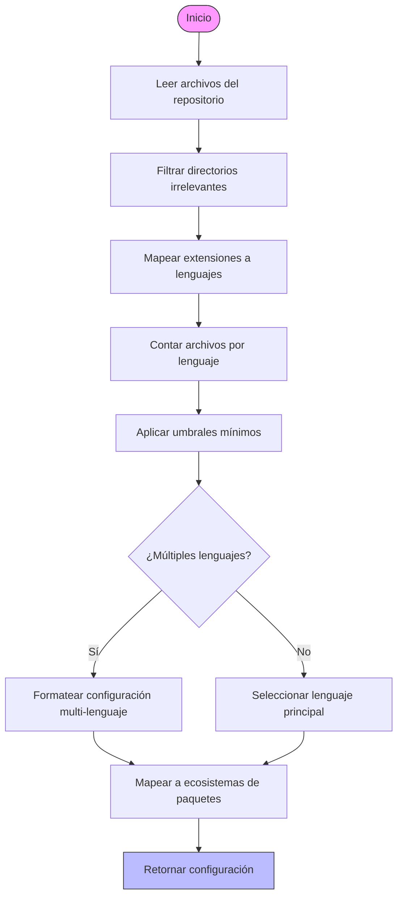
```mermaid
flowchart TD
    Start([Inicio]) --> ReadFiles[Leer archivos del repositorio]
    ReadFiles --> FilterFiles[Filtrar directorios irrelevantes]
    FilterFiles --> MapExtensions[Mapear extensiones a lenguajes]
    MapExtensions --> CountLanguages[Contar archivos por lenguaje]
    CountLanguages --> ApplyThresholds[Aplicar umbrales mínimos]
    ApplyThresholds --> MultiLangCheck{¿Múltiples lenguajes?}
    
    MultiLangCheck -- Sí --> FormatMultiLang[Formatear configuración multi-lenguaje]
    MultiLangCheck -- No --> SelectPrimary[Seleccionar lenguaje principal]
    
    FormatMultiLang --> MapToEcosystems[Mapear a ecosistemas de paquetes]
    SelectPrimary --> MapToEcosystems
    
    MapToEcosystems --> ReturnConfig[Retornar configuración]
    
    class Start,ReturnConfig round
    style Start fill:#f9f,stroke:#333
    style ReturnConfig fill:#bbf,stroke:#333
```

### Algoritmo de Detección

El sistema emplea un algoritmo adaptativo para la detección precisa de lenguajes:

1. **Análisis de Estructura de Archivos**:
   - Examina recursivamente todos los archivos del repositorio
   - Mapea extensiones de archivos a lenguajes soportados por CodeQL
   - Ignora automáticamente directorios como `.git`, `node_modules`, `vendor`, `dist`
   - Extrae información estadística sobre la frecuencia de lenguajes

2. **Análisis de Frecuencia y Relevancia**:
   - Implementa un sistema de conteo y ponderación por tipo de archivo
   - Establece un umbral mínimo (3+ archivos) para considerar un lenguaje como relevante
   - Identifica el lenguaje predominante y lenguajes secundarios importantes
   - Ordena los lenguajes detectados por relevancia

3. **Generación de Configuración Inteligente**:
   - Produce configuración única para repositorios mono-lenguaje
   - Crea configuración multi-lenguaje adaptativa para proyectos poliglota
   - Ajusta el formato YAML para soportar listas de lenguajes compatibles con CodeQL
   - Implementa un fallback a JavaScript si no se detecta ningún lenguaje adecuado

4. **Mapeo a Ecosistemas para Dependabot**:
   - Traduce lenguajes detectados a sus ecosistemas de paquetes correspondientes
   - Ejemplos de mapeos implementados:
     - JavaScript/TypeScript → npm
     - Python → pip
     - Go → gomod
     - Java/Kotlin → maven
     - C# → nuget
     - Ruby → bundler
     - PHP → composer
     - Rust → cargo

### Soporte Multi-lenguaje

Una de las características más avanzadas es el soporte para análisis multi-lenguaje, que permite:

- Detectar automáticamente repositorios con múltiples lenguajes relevantes
- Configurar correctamente la matriz de lenguajes de CodeQL 
- Formatear adecuadamente la configuración YAML para incluir todos los lenguajes detectados
- Priorizar análisis en lenguajes más prevalentes

### Ventajas del Enfoque

Este sistema inteligente de detección resuelve problemas comunes en la configuración de herramientas de análisis de seguridad:

- **Prevención de Fallos**: Evita que CodeQL falle por intentar analizar lenguajes ausentes
- **Optimización de Recursos**: Enfoca el análisis en los lenguajes realmente utilizados
- **Configuración Adaptativa**: Ajusta automáticamente las configuraciones a cada repositorio
- **Precisión Mejorada**: Reduce falsos negativos al asegurar cobertura completa

## Componentes del Sistema

La arquitectura del sistema se divide en componentes bien definidos y acoplados:

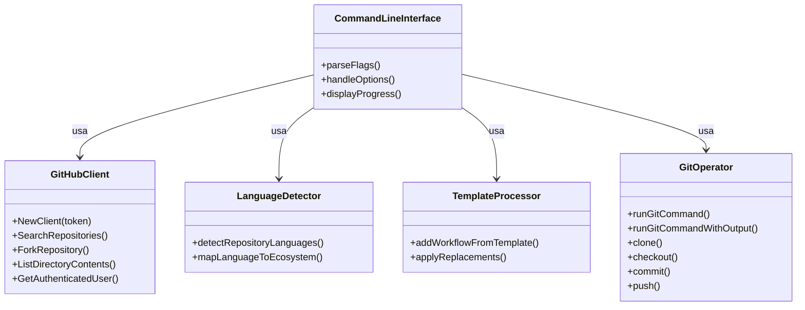
```mermaid
classDiagram
    class GitHubClient {
        +NewClient(token)
        +SearchRepositories()
        +ForkRepository()
        +ListDirectoryContents()
        +GetAuthenticatedUser()
    }
    
    class LanguageDetector {
        +detectRepositoryLanguages()
        +mapLanguageToEcosystem()
    }
    
    class TemplateProcessor {
        +addWorkflowFromTemplate()
        +applyReplacements()
    }
    
    class GitOperator {
        +runGitCommand()
        +runGitCommandWithOutput()
        +clone()
        +checkout()
        +commit()
        +push()
    }
    
    class CommandLineInterface {
        +parseFlags()
        +handleOptions()
        +displayProgress()
    }
    
    CommandLineInterface --> GitHubClient : usa
    CommandLineInterface --> LanguageDetector : usa
    CommandLineInterface --> TemplateProcessor : usa
    CommandLineInterface --> GitOperator : usa
```

### Componentes Principales

1. **Cliente GitHub**: 
   - Encapsula todas las interacciones con la API de GitHub
   - Maneja autenticación, búsqueda, forks y operaciones de contenido
   - Implementa control de límites de tasa y reintentos

2. **Detector de Lenguajes**:
   - Implementa la lógica de análisis de archivos y detección de lenguajes
   - Procesa estadísticas y aplica algoritmos de decisión
   - Mapea lenguajes a sus ecosistemas correspondientes

3. **Procesador de Plantillas**:
   - Gestiona plantillas para todas las herramientas GHAS
   - Aplica transformaciones y reemplazos contextuales
   - Adapta las configuraciones según los lenguajes detectados

4. **Operador Git**:
   - Encapsula operaciones Git como clonación, ramas y empuje
   - Maneja autenticación y gestión de errores
   - Implementa estrategias para resolver conflictos

5. **Interfaz de Línea de Comandos**:
   - Proporciona API usable para usuarios finales
   - Gestiona opciones de configuración y modo de operación
   - Muestra feedback y progreso durante la ejecución

## Buenas Prácticas y Consideraciones

### Seguridad

- **Autenticación**: Use un token de GitHub con los permisos mínimos necesarios
- **Scopes recomendados**: `repo`, `workflow`, `read:org` (si analiza repos organizacionales)
- **Almacenamiento**: Nunca almacene tokens en archivos de configuración versionados
- **Revocación**: Rote periódicamente los tokens de acceso

### Rendimiento

- **Límites de API**: La herramienta respeta automáticamente los límites de tasa de GitHub
- **Procesamiento por lotes**: Configure el parámetro `-m` para procesar repositorios en lotes
- **Esperas**: Incluye esperas entre solicitudes para evitar bloqueos temporales

### Almacenamiento

- **Forks**: Los forks creados ocupan espacio en su cuenta de GitHub
- **Limpieza**: Use `--cleanup` para eliminar forks después del análisis
- **Archivos temporales**: Los clones locales se eliminan automáticamente al finalizar

### Permisos

- **Alcance de token**: Verifique que el token tenga los permisos necesarios para operaciones sobre forks
- **Configuración de Git**: La herramienta configura automáticamente Git para usar su token
- **Autenticación silenciosa**: No se requiere interacción manual durante las operaciones de Git

## Automatización GHAS

La automatización de GitHub Advanced Security es el componente principal de este proyecto, permitiendo aplicar análisis de seguridad avanzado a repositorios de forma masiva y eficiente.

### Flujo de Trabajo Detallado

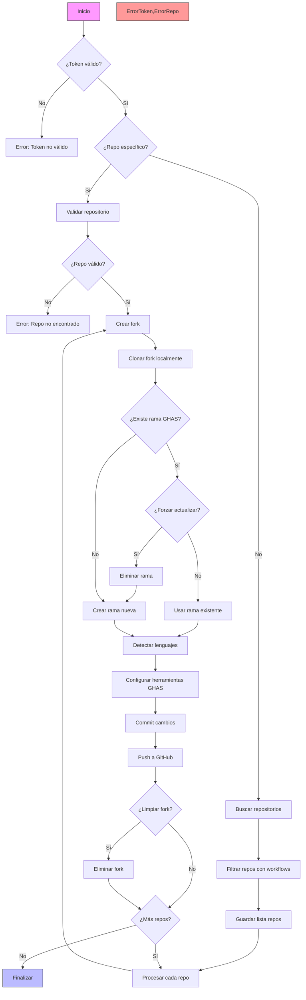
```mermaid
flowchart TD
    Start[Inicio] --> TokenCheck{¿Token válido?}
    TokenCheck -- No --> ErrorToken[Error: Token no válido]
    TokenCheck -- Sí --> RepoSelect{¿Repo específico?}
    
    RepoSelect -- Sí --> ValidateRepo[Validar repositorio]
    RepoSelect -- No --> SearchRepos[Buscar repositorios]
    
    ValidateRepo --> RepoValid{¿Repo válido?}
    RepoValid -- No --> ErrorRepo[Error: Repo no encontrado]
    RepoValid -- Sí --> CreateFork[Crear fork]
    
    SearchRepos --> FilterRepos[Filtrar repos con workflows]
    FilterRepos --> SaveRepos[Guardar lista repos]
    SaveRepos --> RepoLoop[Procesar cada repo]
    RepoLoop --> CreateFork
    
    CreateFork --> Clone[Clonar fork localmente]
    Clone --> BranchCheck{¿Existe rama GHAS?}
    
    BranchCheck -- Sí --> ForceUpdate{¿Forzar actualizar?}
    ForceUpdate -- Sí --> DeleteBranch[Eliminar rama]
    DeleteBranch --> CreateBranch[Crear rama nueva]
    ForceUpdate -- No --> CheckoutExisting[Usar rama existente]
    
    BranchCheck -- No --> CreateBranch
    
    CheckoutExisting --> DetectLanguages[Detectar lenguajes]
    CreateBranch --> DetectLanguages
    
    DetectLanguages --> ConfigGHAS[Configurar herramientas GHAS]
    ConfigGHAS --> CommitChanges[Commit cambios]
    CommitChanges --> PushChanges[Push a GitHub]
    PushChanges --> CleanupCheck{¿Limpiar fork?}
    
    CleanupCheck -- Sí --> DeleteFork[Eliminar fork]
    CleanupCheck -- No --> NextRepo{¿Más repos?}
    DeleteFork --> NextRepo
    
    NextRepo -- Sí --> RepoLoop
    NextRepo -- No --> Finish[Finalizar]
    
    class Start,Finish,ErrorToken,ErrorRepo round
    style Start fill:#f9f,stroke:#333
    style Finish fill:#bbf,stroke:#333
    style ErrorToken,ErrorRepo fill:#f99,stroke:#333
```

### Proceso de Detección de Lenguajes

El componente de detección inteligente de lenguajes analiza el repositorio para identificar correctamente los lenguajes de programación utilizados:

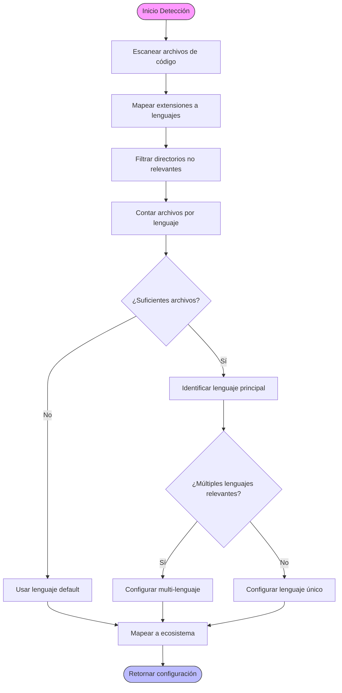
```mermaid
flowchart TB
    Start([Inicio Detección]) --> ScanFiles[Escanear archivos de código]
    ScanFiles --> MapExtensions[Mapear extensiones a lenguajes]
    MapExtensions --> FilterDirs[Filtrar directorios no relevantes]
    FilterDirs --> CountByLang[Contar archivos por lenguaje]
    CountByLang --> ThresholdCheck{¿Suficientes archivos?}
    
    ThresholdCheck -- Sí --> IdentifyPrimary[Identificar lenguaje principal]
    ThresholdCheck -- No --> UseDefault[Usar lenguaje default]
    
    IdentifyPrimary --> SecondaryCheck{¿Múltiples lenguajes relevantes?}
    SecondaryCheck -- Sí --> ConfigureMulti[Configurar multi-lenguaje]
    SecondaryCheck -- No --> ConfigureSingle[Configurar lenguaje único]
    
    UseDefault --> MapEcosystem[Mapear a ecosistema]
    ConfigureMulti --> MapEcosystem
    ConfigureSingle --> MapEcosystem
    
    MapEcosystem --> ReturnResults([Retornar configuración])
    
    class Start,ReturnResults round
    style Start fill:#f9f,stroke:#333
    style ReturnResults fill:#bbf,stroke:#333
```

### Configuración de Herramientas GHAS

La herramienta configura y aplica cuatro componentes de seguridad principales:

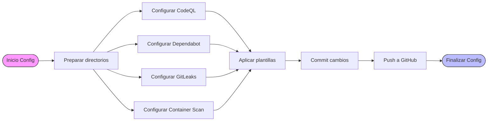
```mermaid
flowchart LR
    Start([Inicio Config]) --> PrepDirs[Preparar directorios]
    
    PrepDirs --> CodeQL[Configurar CodeQL]
    PrepDirs --> Dependabot[Configurar Dependabot]
    PrepDirs --> GitLeaks[Configurar GitLeaks]
    PrepDirs --> ContainerScan[Configurar Container Scan]
    
    CodeQL --> ApplyTemplates[Aplicar plantillas]
    Dependabot --> ApplyTemplates
    GitLeaks --> ApplyTemplates
    ContainerScan --> ApplyTemplates
    
    ApplyTemplates --> Commit[Commit cambios]
    Commit --> Push[Push a GitHub]
    Push --> Finish([Finalizar Config])
    
    class Start,Finish round
    style Start fill:#f9f,stroke:#333
    style Finish fill:#bbf,stroke:#333
```

### Gestión de Forks y Ramas

El sistema implementa una gestión inteligente de forks y ramas:

1. **Verificación de existencia**: Comprueba si ya existe un fork del repositorio en la cuenta del usuario
2. **Gestión de actualizaciones**:
   - Detecta si existe la rama `ghas-analysis` en el fork
   - Permite forzar la actualización con la opción `--force`
   - Maneja conflictos con resolución automática
3. **Autenticación adecuada**:
   - Utiliza el token de GitHub para todas las operaciones
   - Configura Git correctamente para operaciones autenticadas
4. **Limpieza opcional**:
   - Permite eliminar forks después del análisis con `--cleanup`

### Ejemplos de Resultados

Una vez completado el proceso, los resultados del análisis estarán disponibles en la pestaña "Security" del repositorio fork, donde podrá visualizar:

1. **Vulnerabilidades de CodeQL**: Problemas detectados en el código fuente
2. **Alertas de Dependabot**: Dependencias con vulnerabilidades conocidas
3. **Secretos detectados**: Posibles credenciales o tokens expuestos
4. **Vulnerabilidades en contenedores**: Problemas en imágenes Docker

## Solución de Problemas

### Problemas Comunes y Soluciones

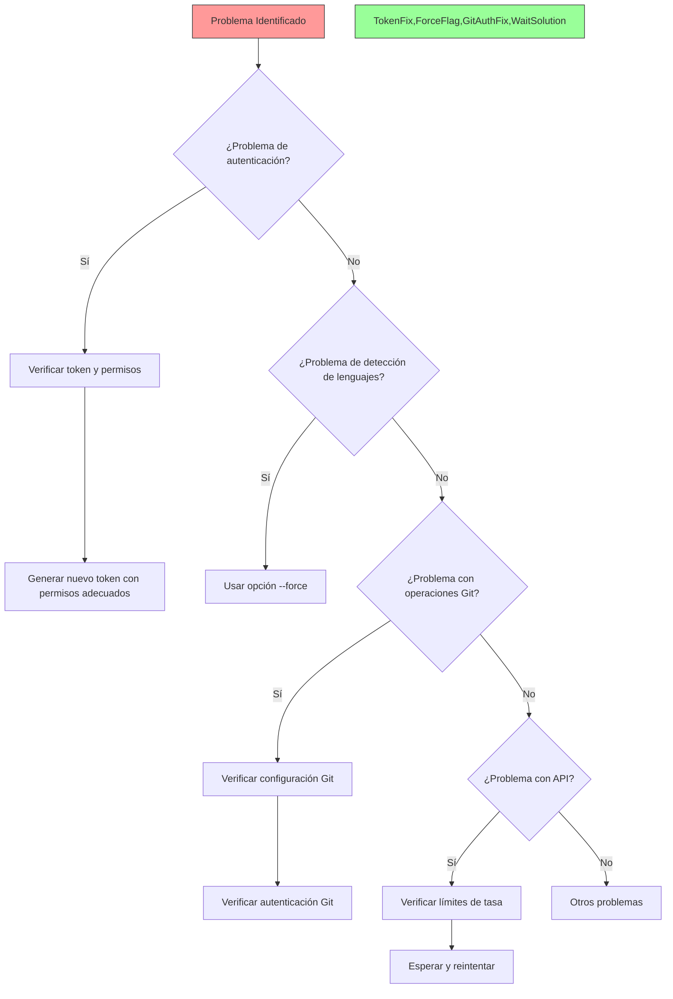
```mermaid
flowchart TD
    Problem[Problema Identificado] --> AuthIssue{¿Problema de autenticación?}
    AuthIssue -- Sí --> TokenCheck[Verificar token y permisos]
    AuthIssue -- No --> LangIssue{¿Problema de detección de lenguajes?}
    
    TokenCheck --> TokenFix[Generar nuevo token con permisos adecuados]
    
    LangIssue -- Sí --> ForceFlag[Usar opción --force]
    LangIssue -- No --> GitIssue{¿Problema con operaciones Git?}
    
    GitIssue -- Sí --> GitConfig[Verificar configuración Git]
    GitIssue -- No --> APIIssue{¿Problema con API?}
    
    GitConfig --> GitAuthFix[Verificar autenticación Git]
    
    APIIssue -- Sí --> RateLimit[Verificar límites de tasa]
    APIIssue -- No --> OtherIssues[Otros problemas]
    
    RateLimit --> WaitSolution[Esperar y reintentar]
    
    class Problem,TokenFix,ForceFlag,GitAuthFix,WaitSolution,OtherIssues round
    style Problem fill:#f99,stroke:#333
    style TokenFix,ForceFlag,GitAuthFix,WaitSolution fill:#9f9,stroke:#333
```

#### Errores de Autenticación

| Problema | Solución |
|----------|----------|
| Token de GitHub no encontrado | Verificar variable `GITHUB_PAT` en entorno o archivo `.env` |
| Error de autenticación | Comprobar validez del token y que tenga permisos `repo` y `workflow` |
| No se puede crear fork | Verificar si ya existe el fork o si el token tiene permisos adecuados |

#### Problemas de Detección de Lenguajes

| Problema | Solución |
|----------|----------|
| Lenguaje incorrecto detectado | Usar `--force` para forzar nueva detección |
| CodeQL falla por lenguaje | Verificar que el lenguaje configurado corresponde al contenido del repositorio |
| No se detecta ningún lenguaje | El repositorio podría no tener archivos de código reconocibles |

#### Problemas con Git

| Problema | Solución |
|----------|----------|
| Error al clonar repositorio | Verificar conectividad y acceso al repositorio |
| Error al enviar cambios | Usar `--force` para sobrescribir cambios en rama existente |
| Conflictos en rama | Eliminar rama existente y crear nueva con `--force` |

#### Límites de API

| Problema | Solución |
|----------|----------|
| Límite de tasa excedido | Esperar y reintentar según cabeceras de límite de GitHub |
| Respuesta lenta de API | Reducir número de repositorios procesados con `-m` |
| Error 404 en repositorio | Verificar existencia y accesibilidad del repositorio |

## Estructura del Proyecto

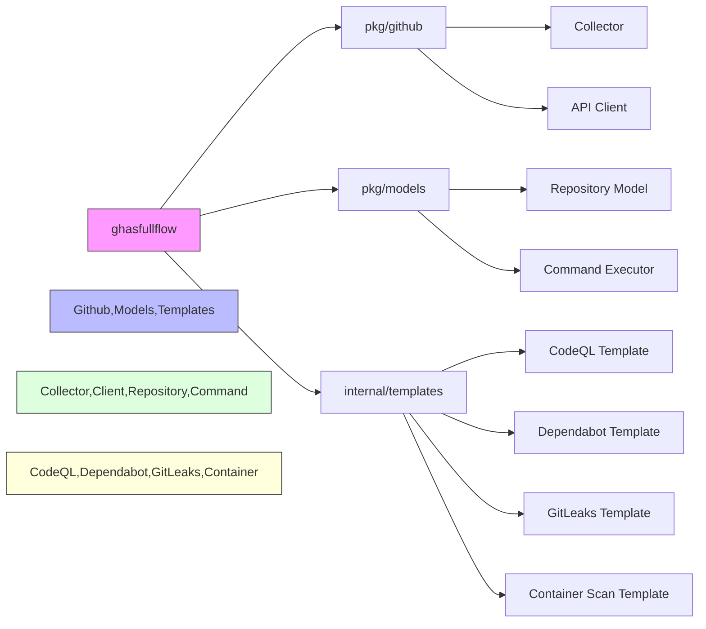
```mermaid
graph LR
    Main[ghasfullflow] --> Github[pkg/github]
    Main --> Models[pkg/models]
    Main --> Templates[internal/templates]
    
    Github --> Collector[Collector]
    Github --> Client[API Client]
    
    Models --> Repository[Repository Model]
    Models --> Command[Command Executor]
    
    Templates --> CodeQL[CodeQL Template]
    Templates --> Dependabot[Dependabot Template]
    Templates --> GitLeaks[GitLeaks Template]
    Templates --> Container[Container Scan Template]
    
    style Main fill:#f9f,stroke:#333
    style Github,Models,Templates fill:#bbf,stroke:#333
    style Collector,Client,Repository,Command fill:#dfd,stroke:#333
    style CodeQL,Dependabot,GitLeaks,Container fill:#ffd,stroke:#333
```

### Principales Archivos y Directorios

- **`/cmd/ghasfullflow/main.go`**: Punto de entrada principal con lógica del flujo completo
- **`/pkg/github/client.go`**: Cliente para interactuar con la API de GitHub
- **`/pkg/models/repository.go`**: Modelos de datos y estructuras para manipular repositorios
- **`/internal/templates/`**: Plantillas para configuraciones de herramientas de seguridad
- **`/ghas-full-flow.sh`**: Script shell para facilitar la ejecución del flujo completo

### Scripts de Utilidad

- **`test-single-repo.sh`**: Permite probar la automatización en un único repositorio
- **`setup.sh`**: Configura el entorno y estructura de directorios necesarios
- **`check_structure.sh`**: Verifica que la estructura del proyecto sea correcta