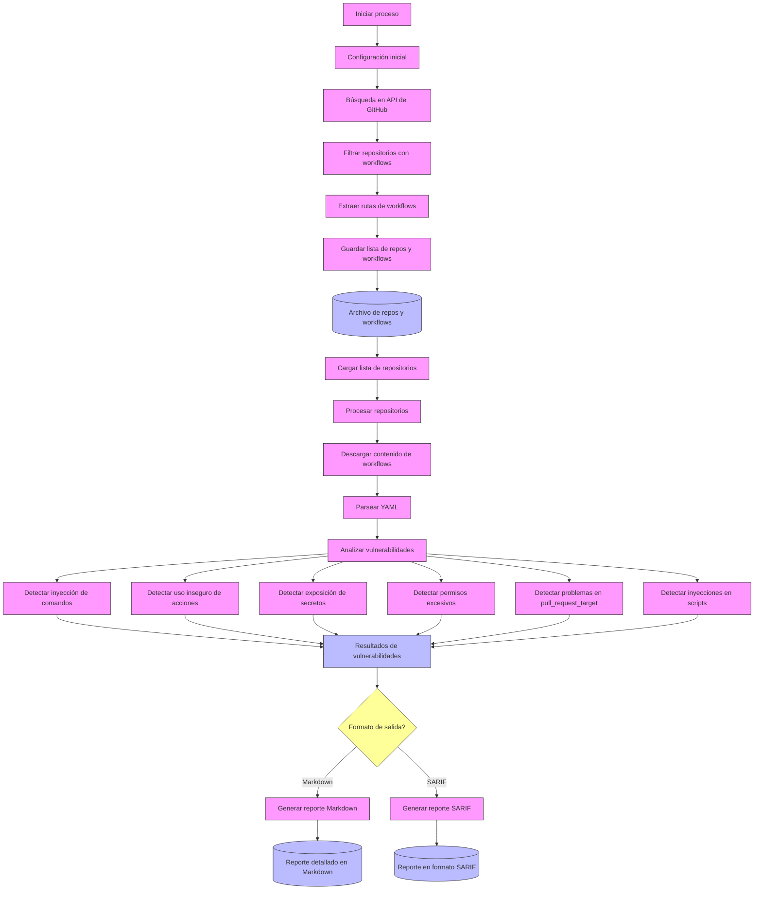

# Flujo de Trabajo del Analizador de Seguridad de GitHub Actions

Este documento describe el flujo de trabajo completo de la herramienta de análisis de seguridad para GitHub Actions, desde la recolección de repositorios hasta la generación de reportes de vulnerabilidades.

## Visión General del Flujo de Trabajo

## 1. Recolección de Repositorios con Workflows (main.go)

**Entrada**: Consulta de búsqueda en GitHub (predeterminado: `path:.github/workflows`)  
**Salida**: Archivo con lista de repositorios y sus workflows

### Pasos:
1. **Configuración Inicial**: 
   - Cargar variables de entorno (.env) y token de GitHub
   - Procesar parámetros de línea de comandos (consulta, máximo de repos)

2. **Búsqueda de Repositorios**: 
   - Utilizar la API de búsqueda de GitHub con paginación
   - Filtrar repositorios que contengan archivos de workflow en `.github/workflows/`

3. **Extracción de Workflows**: 
   - Para cada repositorio encontrado, listar archivos YAML en la carpeta `.github/workflows/`
   - Almacenar la ruta completa de los archivos de workflow

4. **Persistencia**: 
   - Guardar en un archivo de texto la lista de repositorios con sus workflows asociados
   - Formato: `owner/repo: .github/workflows/file1.yml,.github/workflows/file2.yml,...`

## 2. Análisis de Vulnerabilidades (workflow_analyzer.go)

**Entrada**: Archivo de repositorios y workflows generado en el paso anterior  
**Salida**: Reporte de vulnerabilidades (Markdown o SARIF)

### Pasos:
1. **Carga de Datos**: 
   - Leer el archivo de entrada con la lista de repositorios y workflows
   - Establecer conexión con la API de GitHub

2. **Procesamiento de Workflows**:
   - Para cada repositorio, descargar el contenido de sus archivos de workflow
   - Decodificar el contenido (Base64) y parsearlo como YAML

3. **Detección de Vulnerabilidades**:
   - Analizar cada workflow en busca de patrones de vulnerabilidad:
     * **Command Injection**: Inyecciones de comandos en inputs no sanitizados
     * **Unsafe Action Reference**: Referencias inseguras a acciones de terceros
     * **Secret Exposure**: Exposición de secretos en logs o variables
     * **Excessive Permissions**: Permisos excesivos para tokens o workflows
     * **Pull Request Target**: Uso inseguro del evento pull_request_target
     * **Script Injection**: Inyecciones en scripts multilinea

4. **Evaluación de Severidad**:
   - Clasificar cada vulnerabilidad como Alta, Media o Baja
   - Agregar metadatos: ubicación, impacto, vector de explotación, mitigación

## 3. Generación de Reportes

Dependiendo del formato elegido, la herramienta genera uno de estos tipos de reportes:

### Reporte Markdown:
- **Resumen Ejecutivo**: Estadísticas y gráficos de vulnerabilidades por tipo y severidad
- **Análisis Detallado**: Para cada tipo de vulnerabilidad:
  * Descripción general
  * Impacto potencial
  * Ejemplos de explotación
  * Recomendaciones de mitigación
  * Referencias a documentación
- **Ocurrencias**: Código vulnerable específico con ubicación exacta
- **Recomendaciones Generales**: Mejores prácticas para GitHub Actions

### Reporte SARIF (formato JSON estándar):
- Cumple con el esquema SARIF 2.1.0
- Compatible con herramientas de análisis estático y GitHub Code Scanning
- Incluye:
  * Definición de reglas (tipos de vulnerabilidades)
  * Resultados con ubicación precisa
  * Severidad en formato CVSS
  * Mensaje y snippet de código vulnerable

## 4. Flujo de Trabajo de Automatización GHAS

Este flujo complementa el análisis de vulnerabilidades, proporcionando una forma automatizada de aplicar GitHub Advanced Security a repositorios públicos.

```mermaid
flowchart TD
    Start[Iniciar proceso] --> ConfigGHAS[Configuración inicial]
    ConfigGHAS --> RepoDecision{¿Repo específico?}
    
    RepoDecision -- Sí --> ProcessSpecific[Procesar repo específico]
    RepoDecision -- No --> SearchRepos[Buscar repos con workflows]
    
    SearchRepos --> FilterRepos[Filtrar repos válidos]
    FilterRepos --> SaveRepoList[Guardar lista de repos]
    ProcessSpecific --> SaveRepoList
    
    SaveRepoList --> CollectOnly{¿Solo recolección?}
    CollectOnly -- Sí --> End[Finalizar proceso]
    CollectOnly -- No --> ProcessRepos[Procesar repositorios]
    
    ProcessRepos --> Fork[Crear fork del repo]
    Fork --> Clone[Clonar fork localmente]
    Clone --> BranchCheck{¿Existe rama GHAS?}
    
    BranchCheck -- Sí --> ForceCheck{¿Forzar actualización?}
    BranchCheck -- No --> CreateBranch[Crear rama GHAS-analysis]
    
    ForceCheck -- Sí --> DeleteBranch[Eliminar rama existente]
    DeleteBranch --> CreateBranch
    ForceCheck -- No --> CheckoutBranch[Usar rama existente]
    
    CreateBranch --> DetectLanguages[Detectar lenguajes del repo]
    CheckoutBranch --> DetectLanguages
    
    DetectLanguages --> CreateDirs[Crear directorios para configs]
    CreateDirs --> AddCodeQL[Configurar CodeQL]
    AddCodeQL --> AddDependabot[Configurar Dependabot]
    
    AddDependabot --> GitLeaksCheck{¿GitLeaks habilitado?}
    GitLeaksCheck -- Sí --> AddGitLeaks[Configurar GitLeaks]
    GitLeaksCheck -- No --> ContainerCheck
    AddGitLeaks --> ContainerCheck
    
    ContainerCheck{¿Scan contenedores habilitado?}
    ContainerCheck -- Sí --> AddContainerScan[Configurar Trivy]
    ContainerCheck -- No --> Commit
    AddContainerScan --> Commit
    
    Commit[Crear commit con cambios]
    Commit --> Push[Enviar cambios a GitHub]
    Push --> CleanupCheck{¿Limpiar fork?}
    
    CleanupCheck -- Sí --> DeleteFork[Eliminar fork]
    CleanupCheck -- No --> NextRepo
    DeleteFork --> NextRepo
    
    NextRepo{¿Más repos?}
    NextRepo -- Sí --> ProcessRepos
    NextRepo -- No --> End
    
    %% Estilos
    classDef process fill:#f9f,stroke:#333,stroke-width:1px;
    classDef data fill:#bbf,stroke:#333,stroke-width:1px;
    classDef decision fill:#ff9,stroke:#333,stroke-width:1px;
    
    class Start,ConfigGHAS,ProcessSpecific,SearchRepos,FilterRepos,SaveRepoList,ProcessRepos,Fork,Clone,CreateBranch,CheckoutBranch,DeleteBranch,DetectLanguages,CreateDirs,AddCodeQL,AddDependabot,AddGitLeaks,AddContainerScan,Commit,Push,DeleteFork,End process;
    class RepoDecision,CollectOnly,BranchCheck,ForceCheck,GitLeaksCheck,ContainerCheck,CleanupCheck,NextRepo decision;
```

### Entrada y Salida

**Entrada**: 
- Token de acceso personal de GitHub
- Repositorio específico o parámetros de búsqueda
- Opciones de configuración (habilitar/deshabilitar escaneos específicos)

**Salida**:
- Repositorios fork con herramientas de seguridad configuradas
- Análisis automático de seguridad en ejecución

### Pasos Detallados:

#### Fase 1: Recolección de Repositorios

1. **Configuración Inicial**:
   - Cargar token de GitHub y validar permisos
   - Procesar opciones de línea de comandos
   - Crear directorio temporal para clonaciones

2. **Selección de Repositorios**:
   - **Modo Específico**: Si se proporciona un repositorio específico, verificar su existencia y workflows
   - **Modo Búsqueda**: Buscar repositorios que contengan archivos en `.github/workflows/`
   - Almacenar información de repositorios válidos

#### Fase 2: Aplicación de GHAS

Para cada repositorio identificado:

1. **Preparación del Repositorio**:
   - Crear un fork en la cuenta del usuario autenticado
   - Clonar el fork en el directorio temporal
   - Configurar autenticación Git para operaciones posteriores

2. **Gestión de Ramas**:
   - Verificar si existe la rama `ghas-analysis`
   - Si existe y no se usa `--force`, utilizar la rama existente
   - Si existe y se usa `--force`, eliminar la rama y crear una nueva
   - Si no existe, crear una nueva rama

3. **Detección de Lenguajes**:
   - Realizar un análisis de los archivos del repositorio
   - Clasificar archivos por extensión y mapearlos a lenguajes soportados
   - Identificar lenguajes predominantes y relevantes
   - Determinar el ecosistema de paquetes correspondiente

4. **Configuración de Herramientas GHAS**:
   - **CodeQL**: Crear workflow adaptado a los lenguajes detectados
   - **Dependabot**: Configurar para el ecosistema de paquetes identificado
   - **GitLeaks** (opcional): Configurar análisis de secretos
   - **Trivy** (opcional): Configurar análisis de contenedores

5. **Aplicación de Cambios**:
   - Agregar todos los archivos modificados
   - Crear commit con un mensaje descriptivo
   - Configurar URL remota con autenticación incorporada
   - Enviar cambios al fork (force-push si es necesario)

6. **Finalización**:
   - Opcional: eliminar fork si se solicitó limpieza
   - Mostrar URL para acceder a los resultados del análisis

### Componentes Principales

#### 1. Cliente GitHub (`github/client.go`)
Responsable de interactuar con la API de GitHub para:
- Autenticar al usuario
- Buscar repositorios
- Crear y gestionar forks
- Listar contenido de repositorios

#### 2. Detector de Lenguajes (`detectRepositoryLanguages()`)
Analiza el repositorio para identificar:
- Lenguajes de programación utilizados
- Lenguaje predominante
- Lenguajes secundarios relevantes
- Ecosistema de paquetes correspondiente

#### 3. Procesador de Plantillas (`addWorkflowFromTemplate()`)
Aplica plantillas predefinidas para:
- Workflow de CodeQL
- Configuración de Dependabot
- Workflow de GitLeaks
- Workflow de análisis de contenedores

#### 4. Gestor de Git (`runGitCommand()`)
Ejecuta operaciones Git como:
- Clonar repositorios
- Crear y cambiar entre ramas
- Agregar cambios y crear commits
- Enviar cambios a GitHub

### Consideraciones Técnicas

1. **Autenticación**:
   - Se utiliza un token personal de acceso para autenticar todas las operaciones
   - Se incorpora el token en las URLs de Git para operaciones autenticadas

2. **Detección de Lenguajes**:
   - Algoritmo de análisis basado en extensiones de archivos
   - Ponderación por frecuencia para determinar relevancia
   - Soporte para configuraciones multi-lenguaje en CodeQL

3. **Manejo de Errores**:
   - Detección y gestión de fallos en operaciones de API
   - Recuperación en caso de errores no críticos
   - Registro detallado para diagnóstico

4. **Limitación de Tasa**:
   - Esperas entre operaciones para evitar límites de la API de GitHub
   - Procesamiento secuencial para optimizar uso de recursos

### Extensibilidad

El diseño modular permite extender la funcionalidad:

1. **Nuevas Herramientas**: Agregar nuevas plantillas y lógica de configuración
2. **Lenguajes Adicionales**: Expandir la detección de lenguajes y mapeos de ecosistemas
3. **Opciones de Configuración**: Incorporar parámetros adicionales para personalización
4. **Integración con CI/CD**: Adaptar para ejecutar como parte de pipelines existentes

### Limitaciones Actuales

1. No realiza análisis de cobertura de código
2. No configura Code Owners ni políticas de seguridad
3. No administra permisos específicos de repositorio
4. No integra resultados del análisis en sistemas externos

### Próximas Mejoras

1. Integración con GitHub Enterprise Server
2. Soporte para políticas de seguridad personalizadas
3. Generación de reportes consolidados de vulnerabilidades
4. Opciones avanzadas de configuración de CodeQL
