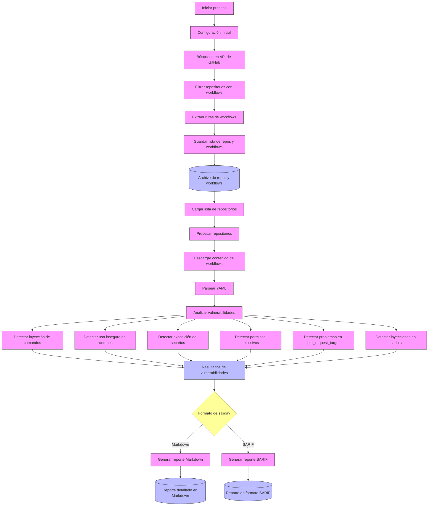

# Flujo de Trabajo del Analizador de Seguridad de GitHub Actions

Este documento describe el flujo de trabajo completo de la herramienta de análisis de seguridad para GitHub Actions, desde la recolección de repositorios hasta la generación de reportes de vulnerabilidades.

## Visión General del Flujo de Trabajo

## 1. Recolección de Repositorios con Workflows (main.go)

**Entrada**: Consulta de búsqueda en GitHub (predeterminado: `path:.github/workflows`)  
**Salida**: Archivo con lista de repositorios y sus workflows

### Pasos:
1. **Configuración Inicial**: 
   - Cargar variables de entorno (.env) y token de GitHub
   - Procesar parámetros de línea de comandos (consulta, máximo de repos)

2. **Búsqueda de Repositorios**: 
   - Utilizar la API de búsqueda de GitHub con paginación
   - Filtrar repositorios que contengan archivos de workflow en `.github/workflows/`

3. **Extracción de Workflows**: 
   - Para cada repositorio encontrado, listar archivos YAML en la carpeta `.github/workflows/`
   - Almacenar la ruta completa de los archivos de workflow

4. **Persistencia**: 
   - Guardar en un archivo de texto la lista de repositorios con sus workflows asociados
   - Formato: `owner/repo: .github/workflows/file1.yml,.github/workflows/file2.yml,...`

## 2. Análisis de Vulnerabilidades (workflow_analyzer.go)

**Entrada**: Archivo de repositorios y workflows generado en el paso anterior  
**Salida**: Reporte de vulnerabilidades (Markdown o SARIF)

### Pasos:
1. **Carga de Datos**: 
   - Leer el archivo de entrada con la lista de repositorios y workflows
   - Establecer conexión con la API de GitHub

2. **Procesamiento de Workflows**:
   - Para cada repositorio, descargar el contenido de sus archivos de workflow
   - Decodificar el contenido (Base64) y parsearlo como YAML

3. **Detección de Vulnerabilidades**:
   - Analizar cada workflow en busca de patrones de vulnerabilidad:
     * **Command Injection**: Inyecciones de comandos en inputs no sanitizados
     * **Unsafe Action Reference**: Referencias inseguras a acciones de terceros
     * **Secret Exposure**: Exposición de secretos en logs o variables
     * **Excessive Permissions**: Permisos excesivos para tokens o workflows
     * **Pull Request Target**: Uso inseguro del evento pull_request_target
     * **Script Injection**: Inyecciones en scripts multilinea

4. **Evaluación de Severidad**:
   - Clasificar cada vulnerabilidad como Alta, Media o Baja
   - Agregar metadatos: ubicación, impacto, vector de explotación, mitigación

## 3. Generación de Reportes

Dependiendo del formato elegido, la herramienta genera uno de estos tipos de reportes:

### Reporte Markdown:
- **Resumen Ejecutivo**: Estadísticas y gráficos de vulnerabilidades por tipo y severidad
- **Análisis Detallado**: Para cada tipo de vulnerabilidad:
  * Descripción general
  * Impacto potencial
  * Ejemplos de explotación
  * Recomendaciones de mitigación
  * Referencias a documentación
- **Ocurrencias**: Código vulnerable específico con ubicación exacta
- **Recomendaciones Generales**: Mejores prácticas para GitHub Actions

### Reporte SARIF (formato JSON estándar):
- Cumple con el esquema SARIF 2.1.0
- Compatible con herramientas de análisis estático y GitHub Code Scanning
- Incluye:
  * Definición de reglas (tipos de vulnerabilidades)
  * Resultados con ubicación precisa
  * Severidad en formato CVSS
  * Mensaje y snippet de código vulnerable

## Ventajas de este Enfoque

1. **Escalabilidad**: El proceso en dos etapas permite analizar grandes cantidades de repositorios
2. **Compatibilidad**: Los formatos de salida son estándar en la industria
3. **Contexto Completo**: Cada vulnerabilidad incluye contexto, impacto y recomendaciones
4. **Integración**: Los reportes SARIF pueden integrarse con sistemas de CI/CD existentes

## Limitaciones

1. Análisis estático sin ejecución real de los workflows
2. Dependencia de patrones predefinidos para la detección
3. Posibles falsos positivos que requieren validación manual
